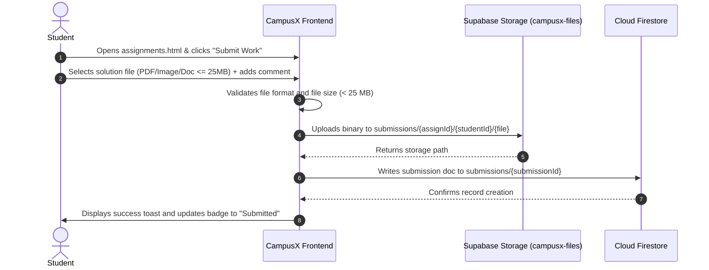
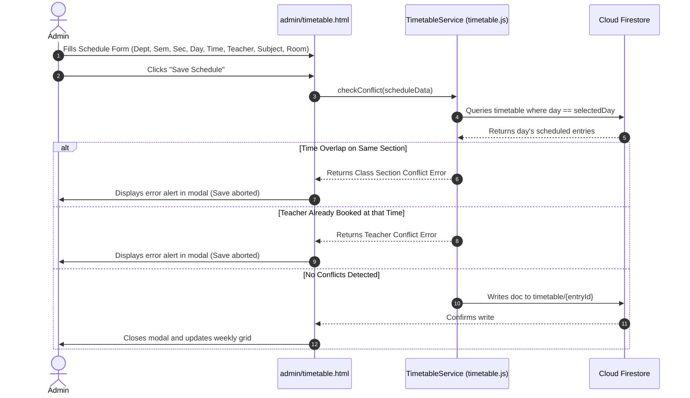

# CampusX — College Management & Student Engagement Platform

> **"One Campus. One Platform. Everything Students Need."**

[](https://campusx-7cxs-esdg6sqbw-self-coders.vercel.app/)
[](LICENSE)
[-orange?style=for-the-badge)](https://campusx-7cxs-esdg6sqbw-self-coders.vercel.app/)

---

## 1. Project Overview

**CampusX** is a centralized, cloud-native college management and scholastic productivity platform engineered for modern higher educational institutions. It brings students, faculty members, and academic administrators into a unified, role-governed digital ecosystem.

Built using semantic HTML5 (HyperText Markup Language 5), modern CSS3 (Cascading Style Sheets 3), and standard Vanilla JavaScript (ES6+), CampusX eliminates complex frontend build steps. The backend architecture leverages a hybrid cloud model:
- **Google Firebase**: Provides user identity management via Firebase Authentication (Email/Password and Google OAuth 2.0 Open Authorization) and structured NoSQL application metadata through Cloud Firestore.
- **Supabase Storage**: Provides secure, private object storage for all academic files (study notes, assignments, student submissions, notices, and circulars) inside an authenticated, non-public storage bucket (`campusx-files`).

The live application is deployed on Vercel: **[https://campusx-7cxs-esdg6sqbw-self-coders.vercel.app/](https://campusx-7cxs-esdg6sqbw-self-coders.vercel.app/)**

---

## 2. Problem Statement

Collegiate administration and academic coordination often suffer from persistent communication gaps:
1. **Fragmented Study Resources**: Lecture notes, slides, and syllabus documents are scattered across personal messaging groups, third-party drives, and physical paper copies, resulting in lost documents and version confusion.
2. **Unstructured Assignment Submission**: Coursework submissions through email inboxes lack deadline enforcement, timestamp verification, student roll number attribution, and central tracking.
3. **Attendance Opacity & University 75% Rule Compliance**: Students frequently struggle to know whether they meet the university-mandated 75% attendance threshold until exam hall tickets are withheld.
4. **Scattered Announcements**: College notices and circulars physically posted on bulletin boards fail to reach students promptly.
5. **Class Schedule Conflicts**: Manual scheduling results in overlapping lecture periods for classes and double-booking of instructors across departments.
6. **Productivity Disconnect**: Students constantly toggle between external task apps and timer tools rather than maintaining focus within their academic portal.

---

## 3. Project Objectives

- **Unified Access**: Provide a single authenticated gateway tailored to Students, Teachers, and Administrators.
- **Strict Role-Based Security**: Enforce Role-Based Access Control (RBAC) at both the client layer (route guards) and the cloud database layer (declarative security rules).
- **Private Cloud Storage**: Store academic files securely in private object storage, preventing unauthenticated public web access and streaming files via time-limited signed URLs or direct authenticated blobs.
- **Automated Conflict Detection**: Guarantee that class schedules cannot overlap for a section or an instructor.
- **Real-Time Attendance Analytics**: Track per-session attendance and compute actionable insights (classes needed to reach 75% or safe bunks).
- **Zero-Dependency Productivity**: Embed personal study task management and a Pomodoro focus timer with native browser audio synthesis.

---

## 4. Main Features

- 🔐 **Multi-Provider Authentication**: Email/Password registration and login, Google Sign-In popup, Firebase Email Verification, and self-service Password Reset.
- 👨‍🎓 **Student Hub**: Dashboard with personalized greeting, real-time "Happening Now" class detector, study notes library, digital assignment submission portal, statutory 75% attendance predictor, weekly timetable, exam schedule viewer, task planner, Pomodoro focus timer, and notifications.
- 👨‍🏫 **Faculty Command Center**: Academic lecture notes manager (mandatory upload), assignment creator (optional problem sheet attachment) with submission review pipeline, session-wise attendance marking, departmental notices, administrative circulars, personal schedule viewer, and student roster.
- 🛡️ **Administrator Portal**: Institutional KPIs (Key Performance Indicators), user directory with role promotion/suspension, teacher account approval, academic department management, subject curriculum configuration, central content moderation, and class timetable scheduling.
- 📅 **Conflict-Validated Class Timetable**: Multi-section weekly timetable management with double-conflict validation (rejects class slot overlap and teacher double-booking).
- 🌓 **Adaptive Theme**: One-click Light and Dark mode toggle with persistent state saved in browser LocalStorage.

---

## 5. User Roles

CampusX implements three distinct roles with dedicated portal directories and granular permissions:

```
                      +-------------------+
                      |   CampusX Users   |
                      +---------+---------+
                                |
        +-----------------------+-----------------------+
        |                       |                       |
        v                       v                       v
+---------------+       +---------------+       +---------------+
|    STUDENT    |       |    TEACHER    |       | ADMINISTRATOR |
| Role: student |       | Role: teacher |       | Role: admin   |
| Status: active|       | Status:       |       | Status: active|
|               |       | pending/active|       |               |
+---------------+       +---------------+       +---------------+
```

### 5.1 Student (`role: "student"`)
- Registered publicly via the registration portal or Google Sign-In.
- Default account status: `active`.
- Access granted exclusively to the `/student/` directory.
- Permissions: Read academic materials, submit coursework solutions for their own UID (User Identifier), read personal attendance records, view personal class schedules, and manage local productivity tasks.

### 5.2 Teacher (`role: "teacher"`)
- Registered publicly via the registration portal or Google Sign-In with designation and department.
- Default account status: `pending` (requires administrator approval before academic write operations are unlocked).
- Access granted to the `/teacher/` directory.
- Permissions: Upload lecture notes, create and edit assignments, inspect student solution files, mark session attendance, broadcast notices, issue circulars, and view personal teaching schedules.

### 5.3 Administrator (`role: "admin"`)
- Seeded or promoted directly by an existing administrator. Cannot be registered through public registration.
- Default account status: `active`.
- Access granted to `/admin/` as well as administrative authority across `/student/` and `/teacher/`.
- Permissions: Modify user roles (`student` ⇄ `teacher` ⇄ `admin`), approve pending faculty accounts, suspend/activate users, manage departments and subjects, create and modify timetables, delete content, and moderate resources.

---

## 6. Student Features

| Module | Location | Description |
|---|---|---|
| **Overview Dashboard** | [`student/dashboard.html`](student/dashboard.html) | Morning/afternoon greeting, attendance percentage, pending assignment counter, Pomodoro study hours, upcoming exams count, today's schedule with "Happening Now" badge, and recent notices. |
| **Study Notes Repository** | [`student/notes.html`](student/notes.html) | Browse verified faculty lecture notes, search by keyword, filter by subject, securely view documents in a new tab, or download files. |
| **Assignments & Submissions** | [`student/assignments.html`](student/assignments.html) | View coursework deadlines, urgency priority badges (`Urgent`, `Important`, `Normal`), download teacher problem attachments, submit digital solution files (<25 MB) with student comments, and view submission status. |
| **Attendance & 75% Predictor** | [`student/attendance.html`](student/attendance.html) | View subject-wise attended vs. total lectures, percentage progress bars, overall institution gauge, and real-time calculation of consecutive classes needed or safe bunks under the 75% statutory rule. |
| **Weekly Timetable** | [`student/timetable.html`](student/timetable.html) | Auto-populates student's department, semester, and section; renders Monday–Sunday lecture grid; highlights today's active and upcoming classes; includes a "My Class" 1-click filter reset. |
| **Exam Schedule** | [`student/exams.html`](student/exams.html) | Displays mid-term and end-semester dates, time slots, exam room/hall numbers, course codes, and maximum marks. |
| **Planner & Pomodoro Timer** | [`student/planner.html`](student/planner.html) | Local task manager (add, toggle, delete tasks) paired with an interactive Pomodoro timer (25 min Focus, 5 min Short Break, 15 min Long Break) featuring zero-asset audio chimes via Web Audio API. |
| **Notification Center** | [`student/notifications.html`](student/notifications.html) | Feed of academic announcements and assignment notifications with unread counter badges and "Mark All as Read". |
| **Student Profile** | [`student/profile.html`](student/profile.html) | View student enrollment number, department, semester, and update editable personal details (bio, phone number). |

---

## 7. Teacher Features

| Module | Location | Description |
|---|---|---|
| **Faculty Dashboard** | [`teacher/dashboard.html`](teacher/dashboard.html) | Academic KPIs (notes uploaded, active assignments, notices published, enrolled students), quick action links, pending approval alerts, and recent material list. |
| **Curriculum Notes Manager** | [`teacher/notes.html`](teacher/notes.html) | Upload study materials with **mandatory file attachment** (<25 MB), subject tag, title, and description. Securely view, download, or delete uploaded notes. |
| **Assignments Manager** | [`teacher/assignments.html`](teacher/assignments.html) | Create coursework with title, department/semester/section target, subject, deadline, priority, and optional problem sheet attachment; review, view, and download student submitted solution files. |
| **Attendance Marker** | [`teacher/attendance.html`](teacher/attendance.html) | Select department, semester, section, subject, date, and period; automatically load active enrolled students from Firestore; mark Present/Absent individually or in bulk; save session records with batch write. |
| **Department Notices** | [`teacher/notices.html`](teacher/notices.html) | Broadcast notices to specific departments or campus-wide with priority flags (`Normal`, `Important`, `Urgent`) and optional file attachments. |
| **Official Circulars** | [`teacher/circulars.html`](teacher/circulars.html) | Issue institutional circulars with optional administrative attachments. |
| **My Teaching Schedule** | [`teacher/timetable.html`](teacher/timetable.html) | Auto-filtered weekly timetable showing all lectures assigned to the logged-in teacher across departments, semesters, and sections. |
| **Students Roster** | [`teacher/students.html`](teacher/students.html) | Search and filter enrolled students across departments and semesters with roll numbers and contact emails. |
| **Faculty Profile** | [`teacher/profile.html`](teacher/profile.html) | View designation, department, cabin/office room, and update personal biography. |

---

## 8. Admin Features

| Module | Location | Description |
|---|---|---|
| **Admin Dashboard** | [`admin/dashboard.html`](admin/dashboard.html) | Campus-wide overview metrics: Total Students, Faculty Members, Academic Subjects, Curriculum Notes, Active Assignments, and Published Notices; recently registered users table. |
| **User Directory & Roles** | [`admin/users.html`](admin/users.html) | Search and filter all registered platform users; reassign roles (`Student` ⇄ `Teacher` ⇄ `Admin`); approve pending teachers; suspend or activate accounts; delete user records. |
| **Teacher Verification** | [`admin/teachers.html`](admin/teachers.html) | Dedicated faculty roster to inspect credentials, designation, office cabin, and approve or suspend faculty accounts. |
| **Student Directory** | [`admin/students.html`](admin/students.html) | Search and inspect student roll numbers, departments, semesters, and enrollment status. |
| **Academic Departments** | [`admin/departments.html`](admin/departments.html) | Create and manage academic departments with department code, appointed HOD (Head of Department), and intake capacity. |
| **Curriculum Subjects** | [`admin/subjects.html`](admin/subjects.html) | Configure curriculum subjects with subject code, subject title, target semester, department affiliation, and primary instructor name. |
| **Timetable Manager** | [`admin/timetable.html`](admin/timetable.html) | Create, edit, and delete recurring weekly timetable slots with dual view (Weekly Grid and List View), filter bar, active teacher selector, and double-conflict detection. |
| **Central Moderation** | [`admin/content.html`](admin/content.html) | Review and delete notes, assignments, notices, and student submissions across all departments. |
| **Platform Settings** | [`admin/settings.html`](admin/settings.html) | View environment diagnostic parameters, Firebase SDK version info, and save institutional session settings. |

---

## 9. Authentication System

The authentication layer is implemented in [`js/auth.js`](js/auth.js) using the Firebase Authentication Web SDK (Software Development Kit):

1. **Email & Password Authentication**:
   - `firebase.auth().signInWithEmailAndPassword(email, password)`
   - `firebase.auth().createUserWithEmailAndPassword(email, password)`
   - Password strength validation: minimum 6 characters.
2. **Google OAuth 2.0 Sign-In**:
   - `firebase.auth().signInWithPopup(new firebase.auth.GoogleAuthProvider())`
   - Configured with `prompt: "select_account"`.
   - New Google users are automatically provisioned in Firestore as `student` (active) or `teacher` (pending). Public Google Sign-In can **never** self-assign the `admin` role.
3. **Email Verification**:
   - Dispatched automatically upon registration via `user.sendEmailVerification()`.
   - Tracked in real time via `user.emailVerified`.
   - Unverified accounts display a persistent top banner in dashboards with a "Resend Verification Email" action button.
4. **Self-Service Password Reset**:
   - Dispatched securely via `firebase.auth().sendPasswordResetEmail(email)`.
5. **Account Status Verification**:
   - Suspended accounts (`status: "suspended"`) are blocked during login and immediately signed out.
6. **Session Management**:
   - Active profile cached in `sessionStorage` under `campusx_user_profile`.
   - Route guard in [`js/guards.js`](js/guards.js) inspects directory paths (`/student/`, `/teacher/`, `/admin/`) and redirects unauthorized users.

---

## 10. Database Architecture

Application data is persisted in **Google Cloud Firestore**, a NoSQL document database.

```
Firestore Root (databases/(default)/documents)
├── users/{userId}                 --> User accounts & role metadata
├── notes/{noteId}                 --> Study note records & storage pointers
├── assignments/{assignId}         --> Assignment definitions & deadlines
├── submissions/{submissionId}     --> Student assignment solutions
├── attendance/{recordId}          --> Session-wise individual student attendance
├── timetable/{entryId}            --> Weekly recurring class schedule slots
├── notices/{noticeId}             --> Department & campus announcements
├── circulars/{circId}             --> Official administrative circulars
├── departments/{deptId}           --> Academic department records
├── subjects/{subjectId}           --> Course curriculum subjects
├── exams/{examId}                 --> Exam timetable & hall allocations
└── notifications/{notifId}        --> System alerts & unread flags
```

---

## 11. File Storage Architecture

All binary documents are stored in **Supabase Storage** under a private bucket named **`campusx-files`**.

```
Supabase Storage Bucket: "campusx-files" (PRIVATE)
├── notes/{noteId}/{cleanFileName}
├── assignments/{assignId}/{timestamp}.{ext}
├── submissions/{assignmentId}/{studentId}/{timestamp}_{cleanFileName}
├── notices/{noticeId}.{ext}
└── circulars/{circId}.{ext}
```

### Storage Security & Access Control
- **Private Bucket**: The bucket has public access disabled. Files cannot be accessed via direct unauthenticated URLs.
- **Firebase JWT Authorization**: [`js/supabase-config.js`](js/supabase-config.js) retrieves the Firebase ID token (`user.getIdToken()`) and passes it as `Authorization: Bearer <idToken>` to the Supabase client.
- **Viewing Private Files**: Generates a temporary, 60-second time-limited signed URL via `createSignedUrl(path, 60)` that is rendered in a new browser tab.
- **Downloading Private Files**: Uses `client.storage.from('campusx-files').download(path)` to stream the file as a Blob directly through the authenticated channel into browser memory, creating and revoking a temporary Object URL.
- **Allowed Formats**: PDF (`.pdf`), JPEG (`.jpg`, `.jpeg`), PNG (`.png`), Word Document (`.doc`, `.docx`).
- **File Size Limit**: Strictly enforced at **25 MB** maximum.

---

## 12. Security & Authorization

Security is enforced through a defense-in-depth model across three distinct layers:

```
[Layer 1: Client UI]    --> guards.js checks path role vs profile role in sessionStorage
                                  ↓
[Layer 2: Cloud Data]   --> firestore.rules validates request.auth, role claims, ownership
                                  ↓
[Layer 3: File Storage] --> storage.rules & Supabase RLS validate bearer JWT & 25MB limit
```

1. **Frontend Route Guards (`js/guards.js`)**:
   - Inspects URL path.
   - Redirects unauthenticated visitors to `login.html`.
   - Redirects role mismatches (e.g. student attempting to access `/admin/`) to their respective dashboard.
   - Restricts pending teachers from triggering creation modals.
2. **Firestore Security Rules (`firestore.rules`)**:
   - Enforces RBAC on every read, create, update, and delete operation.
   - Self-registration limits roles to `student` (`status: 'active'`) and `teacher` (`status: 'pending'`).
   - Profile updates forbid changing protected fields (`role`, `status`, `email`, `uid`, `approvedBy`, `createdAt`).
   - Students can only read and create their own submissions (`studentId == request.auth.uid`).
   - Students can only read their own attendance records (`studentId == request.auth.uid`).
   - Timetable writes are restricted strictly to administrators (`isAdmin()`).
3. **No Hardcoded Secrets**:
   - Only client-side configuration parameters (Firebase Web Config and Supabase Publishable/Anon values) are included in client bundles.
   - No master private keys or secret administrative credentials exist in the client-side code.

---

## 13. Technology Stack

| Category | Technology / Library | Version / Detail |
|---|---|---|
| **Markup** | HTML5 | Semantic structure, accessible forms |
| **Styling** | CSS3 | CSS Custom Properties (Variables), Flexbox, CSS Grid, Light/Dark theme |
| **Logic** | Vanilla JavaScript | ES6+ Modules, Async/Await, Fetch API, DOM APIs |
| **Identity & Auth** | Google Firebase Authentication | v10.12.2 (Compat CDN), Email/Password, Google OAuth 2.0 |
| **Application Database**| Google Cloud Firestore | v10.12.2 (Compat CDN), Real-time NoSQL document store |
| **File Storage** | Supabase Storage | Supabase JS Client v2 (CDN), Private bucket `campusx-files` |
| **Audio Synthesis** | Native Web Audio API | Zero-dependency synthesized sine wave chimes for Pomodoro |
| **Deployment / Host** | Vercel | Global Edge Network, continuous deployment |

---

## 14. Project Structure

```
c:\Users\DELL\Desktop\mini project\
├── index.html                     # Public landing page with hero, features & role cards
├── login.html                     # Unified authentication portal & password reset
├── register.html                  # Student & Faculty registration form
├── firestore.rules                # Production Cloud Firestore security rules
├── storage.rules                  # Production Firebase Storage security rules (reference)
├── LICENSE                        # Project MIT license
├── README.md                      # Project documentation and guide
│
├── student/                       # Student Portal (11 pages)
│   ├── dashboard.html             # Academic KPIs, today's schedule, deadlines
│   ├── notes.html                 # Lecture notes repository with search & downloads
│   ├── assignments.html           # Coursework deadlines & digital submission portal
│   ├── attendance.html            # Subject attendance & statutory 75% rule predictor
│   ├── timetable.html             # Class schedule with live lecture detection
│   ├── exams.html                 # Exam dates, halls, and marks allocation
│   ├── notices.html               # Campus & departmental announcements
│   ├── circulars.html             # Official administrative circulars
│   ├── planner.html               # Task planner & Pomodoro focus timer
│   ├── notifications.html         # Alerts feed & unread counter
│   └── profile.html               # Student academic profile & editable bio
│
├── teacher/                       # Faculty Portal (9 pages)
│   ├── dashboard.html             # Faculty overview, KPIs & quick actions
│   ├── notes.html                 # Lecture notes manager (mandatory file upload)
│   ├── assignments.html           # Coursework creator & student submissions viewer
│   ├── attendance.html            # Session attendance marker with batch save
│   ├── timetable.html             # Personal faculty teaching schedule
│   ├── notices.html               # Department notice publisher
│   ├── circulars.html             # Official circular publisher
│   ├── students.html              # Enrolled students class roster
│   └── profile.html               # Faculty profile details
│
├── admin/                         # Administrator Portal (9 pages)
│   ├── dashboard.html             # Institutional metrics & recent users
│   ├── users.html                 # User directory, role promotion & account status
│   ├── teachers.html              # Faculty roster, verification & approval
│   ├── students.html              # Student directory & enrollment status
│   ├── departments.html           # Academic departments CRUD
│   ├── subjects.html              # Course curriculum subjects configuration
│   ├── timetable.html             # Timetable manager with double-conflict validation
│   ├── content.html               # Central moderation of notes, assignments, notices
│   └── settings.html              # Platform diagnostics & session settings
│
├── css/                           # Stylesheets (5 files)
│   ├── global.css                 # Color tokens, CSS reset, Light/Dark variables
│   ├── components.css             # Buttons, cards, badges, modals, toasts, tables
│   ├── dashboard.css              # Sidebar, topbar, KPI cards, Pomodoro dial
│   ├── auth.css                   # Auth layouts, role tabs, password toggle
│   └── responsive.css             # Mobile drawer, responsive tables, media queries
│
├── js/                            # JavaScript Controllers & Services (17 files)
│   ├── firebase-config.js         # Firebase App, Auth, Firestore initialization
│   ├── supabase-config.js         # Supabase client, JWT token adapter, file operations
│   ├── auth.js                    # Login, registration, Google OAuth, password reset
│   ├── guards.js                  # Client route protection & UI state synchronization
│   ├── notes.js                   # Notes Firestore CRUD & Supabase file storage
│   ├── assignments.js             # Coursework management & student submission engine
│   ├── attendance.js              # Session marking, personal analytics, 75% formula
│   ├── timetable.js               # Schedule queries, conflict detection, live class tracker
│   ├── notices.js                 # Notices management with optional file upload
│   ├── circulars.js               # Circulars management with optional file upload
│   ├── notifications.js           # Notification store & unread counter handlers
│   ├── planner.js                 # Local task manager & Pomodoro timer engine
│   ├── student.js                 # Student portal dashboard controller
│   ├── teacher.js                 # Faculty portal dashboard controller
│   ├── admin.js                   # Admin portal dashboard controller
│   ├── theme.js                   # Light/Dark mode switcher with LocalStorage
│   └── utils.js                   # Toast notifications, modal helpers, sanitizers
│
└── docs/
    └── COLLEGE_PROJECT_REPORT.md  # Comprehensive academic project report (B.Tech)
```

---

## 15. Important Workflows

### 15.1 Student Assignment Submission Workflow


### 15.2 Timetable Scheduling with Conflict Validation


---

## 16. Local Setup

### Prerequisites
- Modern web browser (Chrome, Edge, Firefox, Safari).
- A local HTTP server (Python, Node.js `npx serve`, or VS Code Live Server).

### Step-by-Step Installation

1. **Clone or Download the Repository**:
   ```bash
   git clone https://github.com/your-username/campusx.git
   cd campusx
   ```

2. **Verify Configuration Files**:
   - Check `js/firebase-config.js` to ensure Firebase credentials are configured.
   - Check `js/supabase-config.js` to ensure Supabase project URL and anon key are configured.

3. **Deploy Database & Storage Rules**:
   - In the [Firebase Console](https://console.firebase.google.com/), open **Firestore Database** → **Rules**, paste `firestore.rules`, and click **Publish**.
   - In the [Supabase Console](https://supabase.com/), verify that the bucket `campusx-files` is created with public access disabled.

4. **Serve the Application Locally**:
   Using Python:
   ```bash
   python -m http.server 8000
   ```
   Or using Node.js:
   ```bash
   npx serve .
   ```

5. **Access the Portal**:
   Open `http://localhost:8000` in your web browser.

---

## 17. Deployment

The application is deployed on **Vercel** with continuous deployment from GitHub:

```
Developer Local Workspace
       │
       ▼ (git push)
GitHub Repository
       │
       ▼ (Webhook trigger)
Vercel Edge Network Build & Deployment
       │
       ▼
Live Website: https://campusx-7cxs-esdg6sqbw-self-coders.vercel.app/
```

- **Frontend Assets**: Served via Vercel's global CDN (Content Delivery Network).
- **Authentication & Database**: Handled by Google Firebase.
- **File Storage**: Handled by Supabase Storage.

---

## 18. Current Limitations

1. **Client-Side Document Parsing**: File type validation relies on client-side MIME checks and file extensions.
2. **Third-Party Auth Dependency**: Supabase Storage authorization depends on passing the Firebase ID token in request headers.
3. **No Push Notification Service Worker**: Notifications are stored in Firestore and checked in-app; native Web Push API is not yet integrated.
4. **Offline Support**: While UI assets can be cached by browsers, full offline mutation queuing is limited by browser connectivity.

---

## 19. Future Improvements

1. **Firebase Cloud Functions**: Automated generation of thumbnail previews for uploaded lecture slides and PDF notes.
2. **Web Push Notifications**: Service Worker integration for browser push alerts on new assignments and urgent circulars.
3. **Automated Attendance OCR**: Optical Character Recognition for digitizing physical paper attendance sheets.
4. **Payment Gateway Integration**: Online fee payment module for semester exam registration and tuition fees.
5. **Mobile Application**: Native Android and iOS wrapper using Capacitor or React Native.

---

## 20. Live Website

The production version of CampusX is deployed and accessible at:

🌐 **[https://campusx-7cxs-esdg6sqbw-self-coders.vercel.app/](https://campusx-7cxs-esdg6sqbw-self-coders.vercel.app/)**

---

### Technical Terms & Full Forms

| Term | Full Form | Meaning in CampusX |
|---|---|---|
| **API** | Application Programming Interface | Set of functions used to communicate between services (e.g. Supabase Storage API, Web Audio API). |
| **BaaS** | Backend-as-a-Service | Cloud services (Firebase, Supabase) providing backend database, authentication, and storage without dedicated custom servers. |
| **CDN** | Content Delivery Network | Globally distributed network of edge servers (Vercel) delivering web assets with low latency. |
| **CRUD** | Create, Read, Update, Delete | The four fundamental persistent storage operations supported across modules. |
| **CSS** | Cascading Style Sheets | Stylesheet language used to format the layout and visual presentation of CampusX. |
| **DOM** | Document Object Model | The browser programming interface for HTML documents manipulated by Vanilla JavaScript. |
| **HTML** | HyperText Markup Language | The standard markup language for creating CampusX web pages. |
| **HOD** | Head of Department | The appointed senior faculty member leading an academic department in CampusX. |
| **JWT** | JSON Web Token | Compact, URL-safe cryptographic token issued by Firebase Auth and sent to Supabase Storage for bearer authorization. |
| **KPI** | Key Performance Indicator | Metric counters displayed on dashboards (e.g. attendance percentage, enrolled students count). |
| **MIME** | Multipurpose Internet Mail Extensions | Standard indicating the nature and format of a file (e.g. `application/pdf`). |
| **NoSQL** | Not Only SQL | Non-relational database paradigm implemented by Google Cloud Firestore. |
| **OAuth** | Open Authorization | Open standard protocol enabling secure third-party login (e.g. Google Sign-In). |
| **PDF** | Portable Document Format | The standard document format supported for notes, assignments, notices, and circulars. |
| **RBAC** | Role-Based Access Control | Access control mechanism restricting system access based on user role (`student`, `teacher`, `admin`). |
| **RLS** | Row Level Security | Database/storage security policies governing access to individual rows or objects. |
| **SDK** | Software Development Kit | Collection of software tools and libraries provided by Firebase and Supabase. |
| **UI** | User Interface | The visual and interactive front-facing screens of CampusX. |
| **UID** | User Identifier | The unique alphanumeric string assigned to each user by Firebase Authentication. |
| **URL** | Uniform Resource Locator | The web address referencing resources or pages in CampusX. |
