# B.Tech Project Report on CampusX
## A Centralized Web-Based College Management & Student Engagement Platform

---

### **Executive Summary & Metadata**
- **Project Title:** CampusX — College Management & Student Engagement Platform
- **Domain:** Web Development, Cloud Computing, Educational Technology (EdTech)
- **Architecture:** Hybrid Cloud Serverless Web Application (Static Frontend on Content Delivery Network [CDN] + Google Firebase Cloud Backend + Supabase Storage Object Tier)
- **Deployment Platform:** Vercel Global Edge Network
- **Live URL:** [https://campusx-7cxs-esdg6sqbw-self-coders.vercel.app/](https://campusx-7cxs-esdg6sqbw-self-coders.vercel.app/)

---

### **Table of Contents**
1. [Introduction](#1-introduction)
2. [Problem Statement](#2-problem-statement)
3. [Objectives](#3-objectives)
4. [Scope](#4-scope)
5. [Technology Stack](#5-technology-stack)
6. [System Architecture](#6-system-architecture)
7. [Application Architecture](#7-application-architecture)
8. [User Roles](#8-user-roles)
9. [Modules](#9-modules)
10. [Authentication & Authorization](#10-authentication--authorization)
11. [Database Design](#11-database-design)
12. [File Storage Design](#12-file-storage-design)
13. [Security Design](#13-security-design)
14. [Detailed Workflows](#14-detailed-workflows)
15. [Student Workflow](#15-student-workflow)
16. [Teacher Workflow](#16-teacher-workflow)
17. [Admin Workflow](#17-admin-workflow)
18. [Notes Workflow](#18-notes-workflow)
19. [Assignment Workflow](#19-assignment-workflow)
20. [Submission Workflow](#20-submission-workflow)
21. [Attendance Workflow](#21-attendance-workflow)
22. [Timetable Workflow](#22-timetable-workflow)
23. [Notices & Circulars Workflow](#23-notices--circulars-workflow)
24. [Notification Workflow](#24-notification-workflow)
25. [Authentication Workflow](#25-authentication-workflow)
26. [Registration & Teacher Approval Workflow](#26-registration--teacher-approval-workflow)
27. [File Upload & Download Workflow](#27-file-upload--download-workflow)
28. [Role-Based Access Workflow](#28-role-based-access-workflow)
29. [Project Directory Structure](#29-project-directory-structure)
30. [Firestore Collections / Data Model](#30-firestore-collections--data-model)
31. [Supabase Storage Architecture](#31-supabase-storage-architecture)
32. [Firebase Security Rules](#32-firebase-security-rules)
33. [Storage Security Rules](#33-storage-security-rules)
34. [Deployment Architecture](#34-deployment-architecture)
35. [Testing Strategy](#35-testing-strategy)
36. [Current Implementation Status](#36-current-implementation-status)
37. [Limitations](#37-limitations)
38. [Future Enhancements](#38-future-enhancements)
39. [Conclusion](#39-conclusion)
40. [Technical Terms & Full Forms](#40-technical-terms--full-forms)

---

## 1. Introduction

Higher education institutions face significant challenges in managing day-to-day academic workflows. Information and scholastic interactions are frequently fragmented across disparate instant messaging groups, unmonitored cloud drives, paper-based attendance registers, and physical bulletin boards. 

**CampusX** ("One Campus. One Platform. Everything Students Need.") is a full-stack, cloud-native web application designed to eliminate administrative fragmentation. It provides a centralized digital campus platform where students, faculty members, and academic administrators interact through dedicated, role-specific portals. 

The software architecture is engineered using semantic HyperText Markup Language 5 (HTML5), modern Cascading Style Sheets 3 (CSS3) Custom Properties, and standard Vanilla JavaScript (ECMAScript 6+ / ES6+), executing completely client-side in the browser without server compilation steps. The backend operates on a hybrid cloud model:
1. **Google Firebase Services**: Manages user identity verification through Firebase Authentication (Email/Password and Google Open Authorization [OAuth] 2.0) and persists structured application metadata in Cloud Firestore (NoSQL document database).
2. **Supabase Storage Engine**: Delivers a private, authenticated object storage bucket (`campusx-files`) for academic binaries (Portable Document Format [PDF] lecture notes, assignments, student solutions, notices, and circulars). Access is secured through Firebase JSON Web Tokens (JWT) and time-limited signed Uniform Resource Locators (URLs).

---

## 2. Problem Statement

Modern college campuses experience operational bottlenecks caused by disjointed tools:
1. **Curriculum Fragmentation**: Lecture notes and problem sheets are shared across informal social messaging groups or third-party links, leading to lost files, version discrepancies, and security risks.
2. **Unregulated Coursework Submission**: Collecting student assignments through email inboxes lacks deadline enforcement, digital timestamps, student roll number attribution, and central grade auditing.
3. **Attendance Opacity & University 75% Statutory Threshold**: University regulations in India typically mandate a minimum 75% attendance threshold for semester examination eligibility. Students frequently lack real-time visibility into their session attendance and cannot calculate whether they are safe or how many consecutive classes they must attend to regain eligibility.
4. **Delayed Institutional Announcements**: Important notifications and administrative circulars posted on physical bulletin boards often fail to reach commuting students in a timely manner.
5. **Class Schedule Overlaps**: Traditional manual timetabling frequently leads to room clashes and double-booking of faculty members across overlapping class periods.
6. **Focus & Productivity Disconnect**: Students constantly switch between academic portals, independent to-do apps, and timer tools.

---

## 3. Objectives

The primary engineering objectives of CampusX are:
- **Centralization**: Unify academic content delivery, coursework submission, class scheduling, attendance tracking, and administrative governance into a single web application.
- **Granular Role-Based Access Control (RBAC)**: Maintain three distinct user tiers (Student, Teacher, Administrator) with client-side route protection and serverless database security rules.
- **Secure Private File Storage**: Protect all academic documents in a private cloud storage bucket, preventing unauthenticated access and streaming files via signed URLs or direct authenticated binary blobs.
- **Automated Timetable Conflict Detection**: Prevent overlapping class schedules and instructor double-booking before database commitment.
- **Actionable Attendance Analytics**: Enable teachers to mark session attendance in bulk and provide students with real-time statutory 75% predictive calculations.
- **Zero-Dependency Productivity Utilities**: Embed an interactive task planner and Pomodoro focus timer utilizing the browser native Web Audio Application Programming Interface (Web Audio API) for sound synthesis without external audio files.

---

## 4. Scope

- **Target Audience**: Undergraduate and postgraduate students, teaching faculty, department heads, and academic administrators across engineering, arts, and science colleges.
- **Platform Availability**: Cross-platform web application compatible with all modern desktop, laptop, tablet, and smartphone browsers.
- **Hosting Environment**: Static frontend served globally via Vercel Edge CDN with cloud-hosted Backend-as-a-Service (BaaS) infrastructure provided by Google Firebase and Supabase.

---

## 5. Technology Stack

### 5.1 Frontend Presentation & Logic
- **HTML5 (Semantic)**: Provides accessible semantic structures, dialog modals, forms, and tables.
- **CSS3 (Custom Properties)**: Implements design tokens, responsive CSS Grid and Flexbox layouts, transition animations, and dark/light theme switching.
- **Vanilla JavaScript (ES6+)**: Employs async/await asynchronous patterns, Document Object Model (DOM) manipulation, and browser APIs without the build overhead of heavy frameworks.
- **Web Audio API**: Synthesizes custom sine-wave audio chimes in real time for Pomodoro timer transitions.

### 5.2 Backend Cloud Services
- **Firebase Authentication**: Provides identity management, password hashing, session tokens, and OAuth 2.0 Google federation.
- **Google Cloud Firestore**: Provides a real-time, document-oriented NoSQL database with multi-tenant declarative security rules.
- **Supabase Storage**: Provides S3-compatible private cloud object storage (`campusx-files`) integrated with Firebase JWT authentication.

### 5.3 Deployment Infrastructure
- **Vercel**: Edge-hosted Content Delivery Network (CDN) with Git-triggered continuous integration and deployment.
- **GitHub**: Source code management and repository hosting.

---

## 6. System Architecture

The following diagram illustrates the high-level system architecture of CampusX:

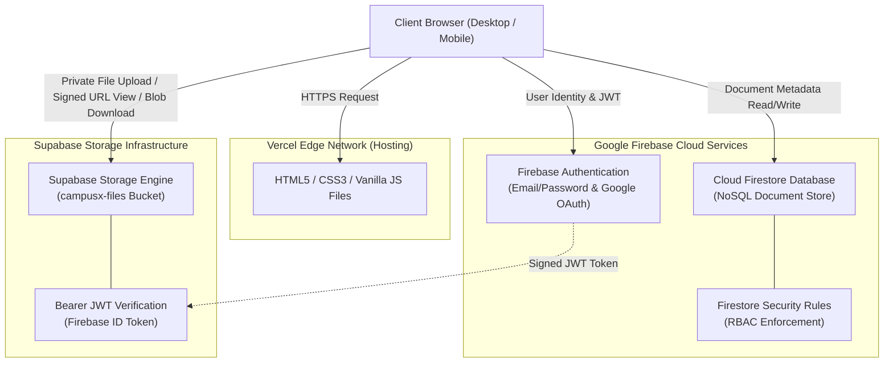

---

## 7. Application Architecture

CampusX utilizes a decoupled three-tier architectural pattern adapted for modern serverless web applications:

1. **Presentation Tier (Client-Side)**:
   - Divided into three root folders: `/student/`, `/teacher/`, and `/admin/`.
   - Reusable styles located in `/css/` (`global.css`, `components.css`, `dashboard.css`, `auth.css`, `responsive.css`).
   - Modular JavaScript controllers in `/js/` manage component state and DOM rendering.
2. **Authorization & Interceptor Tier**:
   - `guards.js` acts as an immediate front controller on every page load, evaluating current session claims in `sessionStorage` against the active directory path.
   - Unauthorized attempts trigger immediate redirects to `login.html` or the user's authorized role dashboard.
3. **Cloud Data & Object Tier**:
   - Cloud Firestore handles all structured entities (users, notes, assignments, submissions, attendance, timetable, notices, circulars, notifications, departments, subjects, exams).
   - Supabase Storage securely stores binary document assets.

---

## 8. User Roles

CampusX defines three distinct user roles with specific system permissions:

| Attribute | Student (`student`) | Teacher (`teacher`) | Administrator (`admin`) |
|---|---|---|---|
| **Portal Path** | `/student/*` | `/teacher/*` | `/admin/*` (and all sub-portals) |
| **Self-Registration** | Yes (Immediate `active` status) | Yes (Registered as `pending`) | No (Direct admin provisioning only) |
| **Account Approval** | Automatic | Requires Admin verification | Pre-authorized |
| **Study Notes** | Read, View, Download | Create, Read, Delete (own notes) | Full Read, Moderate, Delete all |
| **Assignments** | Read, Submit work (<25 MB) | Create, Edit, Inspect submissions | Full Read, Moderate, Delete all |
| **Attendance** | View own records & 75% stats | Mark session records in bulk | Full institutional inspection |
| **Timetable** | Read class schedule | Read personal teaching schedule | Full CRUD & Conflict Management |
| **Announcements** | Read notices and circulars | Publish notices and circulars | Full creation and moderation |
| **User Directory** | View profile only | View enrolled student roster | Full user management & role assignment |

---

## 9. Modules

1. **Authentication Module (`auth.js`)**: Coordinates user registration, login, Google Sign-In, email verification dispatch, password reset, and session storage.
2. **Route Authorization Guard Module (`guards.js`)**: Inspects URL paths against user roles, synchronizes UI topbar/sidebar states, and checks account standing (`active`, `pending`, `suspended`).
3. **Notes Module (`notes.js`)**: Gathers verified faculty lecture notes with mandatory file uploads, keyword filtering, subject sorting, and authenticated downloads.
4. **Assignments & Submissions Module (`assignments.js`)**: Manages coursework creation with optional teacher attachments, deadline tracking, student solution uploads, and faculty review interfaces.
5. **Attendance Analytics Module (`attendance.js`)**: Handles session-wise student attendance marking for teachers and computes personal subject attendance, overall percentages, and statutory 75% rule projections for students.
6. **Class Timetable Module (`timetable.js`)**: Enforces multi-section weekly schedules with live "Happening Right Now" calculation and double-conflict detection.
7. **Notices & Circulars Modules (`notices.js`, `circulars.js`)**: Facilitates the publication of department notices and administrative circulars with optional file attachments.
8. **Productivity Module (`planner.js`)**: Manages personal study tasks and controls the client-side Pomodoro timer with Web Audio API chime sounds.
9. **Notification Center Module (`notifications.js`)**: Maintains institutional announcements with unread counter badges and mark-as-read updates.
10. **Administrative Control Module (`admin.js`)**: Aggregates campus metrics and manages user roles, departments, subjects, and institutional settings.

---

## 10. Authentication & Authorization

Authentication is executed through Google Firebase Authentication:
- **Email & Password**: Verified using `signInWithEmailAndPassword` and created via `createUserWithEmailAndPassword`. Passwords must be at least 6 characters.
- **Google OAuth 2.0**: Handled via `signInWithPopup(GoogleAuthProvider)`.
- **Role Assignment**: When registering publicly, users select either Student (assigned `role: "student"`, `status: "active"`) or Teacher (assigned `role: "teacher"`, `status: "pending"`). Public registration can never grant the `admin` role.
- **Session Caching**: On successful login, the user profile is stored in `sessionStorage` under the key `campusx_user_profile`.

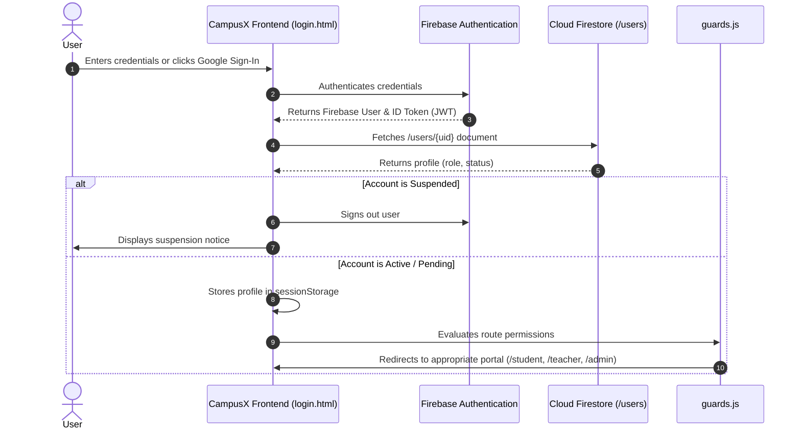

---

## 11. Database Design

CampusX uses Google Cloud Firestore in production mode. Data is organized into flat top-level collections for low latency and independent security scoping.

```
Firestore Database Structure
├── users/                --> User profiles, roles, account standing
├── notes/                --> Lecture notes metadata & Supabase storage paths
├── assignments/          --> Coursework problem sheets & deadlines
├── submissions/          --> Student assignment solution records
├── attendance/           --> Individual per-session student attendance entries
├── timetable/            --> Weekly recurring timetable slots
├── notices/              --> Departmental announcements
├── circulars/            --> Formal institutional circulars
├── departments/          --> Academic departments
├── subjects/             --> Course syllabus and subject curriculum
├── exams/                --> Semester & mid-term exam timetables
└── notifications/        --> User notification alerts
```

---

## 12. File Storage Design

All file attachments in CampusX are stored in **Supabase Storage** within a private bucket named **`campusx-files`**.

```
campusx-files (Private Bucket)
├── notes/{noteId}/{cleanFileName}
├── assignments/{assignId}/{timestamp}.{ext}
├── submissions/{assignmentId}/{studentId}/{timestamp}_{cleanFileName}
├── notices/{noticeId}.{ext}
└── circulars/{circId}.{ext}
```

### Storage Characteristics
- **Bucket Visibility**: Completely private. Public URLs are disabled.
- **Token Passing**: Handled in `js/supabase-config.js`. When a Firebase user logs in, `user.getIdToken()` is fetched and added to the Supabase client headers as `Authorization: Bearer <idToken>`.
- **Signed URL Viewing**: Calls `createSignedUrl(path, 60)`, producing a time-limited 60-second signed URL opened in a new browser tab.
- **Authenticated Blob Download**: Calls `client.storage.from('campusx-files').download(path)`, receives the file as a binary Blob, creates a temporary Object URL in memory, triggers the browser download, and revokes the URL after 1000ms.
- **Supported Formats**: PDF (`.pdf`), JPEG (`.jpg`, `.jpeg`), PNG (`.png`), Word Document (`.doc`, `.docx`).
- **Size Limitation**: Validated on the client and enforced in storage rules at a maximum of **25 MB**.

---

## 13. Security Design

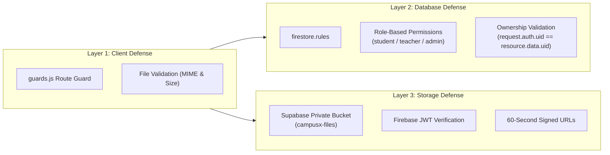

1. **Client-Side Defense**: `guards.js` prevents unauthorized portal navigation; input sanitization utilities (`sanitizeHtml`) prevent Cross-Site Scripting (XSS).
2. **Database Defense**: `firestore.rules` validates every read, create, update, and delete operation on Firestore. Students cannot modify notes, teachers cannot modify other teachers' coursework, and non-admins cannot update timetable or user roles.
3. **Storage Defense**: Academic files cannot be accessed via direct unauthenticated links. Operations require valid Firebase JWTs, and files are streamed via temporary signed URLs or direct memory Blobs.
4. **Credential Safety**: No private keys, service account credentials, or master secrets are included in the frontend code.

---

## 14. Detailed Workflows

The following sections provide step-by-step documentation of all key user and data workflows implemented in the CampusX codebase.

---

## 15. Student Workflow

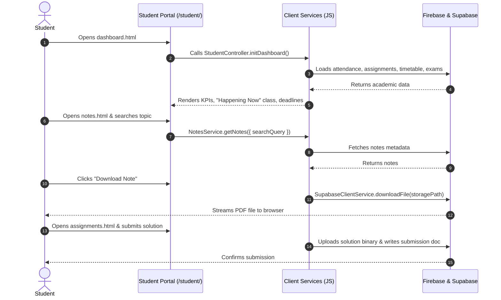

### Step-by-Step Execution:
1. Student navigates to `student/dashboard.html`.
2. `guards.js` verifies that the active session holds `role: "student"` and `status: "active"`.
3. `student.js` initializes the dashboard:
   - Displays a dynamic greeting based on the time of day.
   - Calculates overall attendance using `AttendanceService`.
   - Computes pending assignment counts using `AssignmentsService`.
   - Retrieves today's classes using `TimetableService.getForClass()` and highlights active lectures.
4. When browsing `student/notes.html`, the student enters search keywords; `NotesService.getNotes()` filters matching documents.
5. Clicking "View" requests a 60-second signed URL from Supabase Storage and opens it in a new tab; clicking "Download" streams the file as a Blob.
6. In `student/attendance.html`, the student reviews subject percentages and the 75% rule projection formula.
7. In `student/planner.html`, the student adds study tasks and uses the Pomodoro timer.

---

## 16. Teacher Workflow

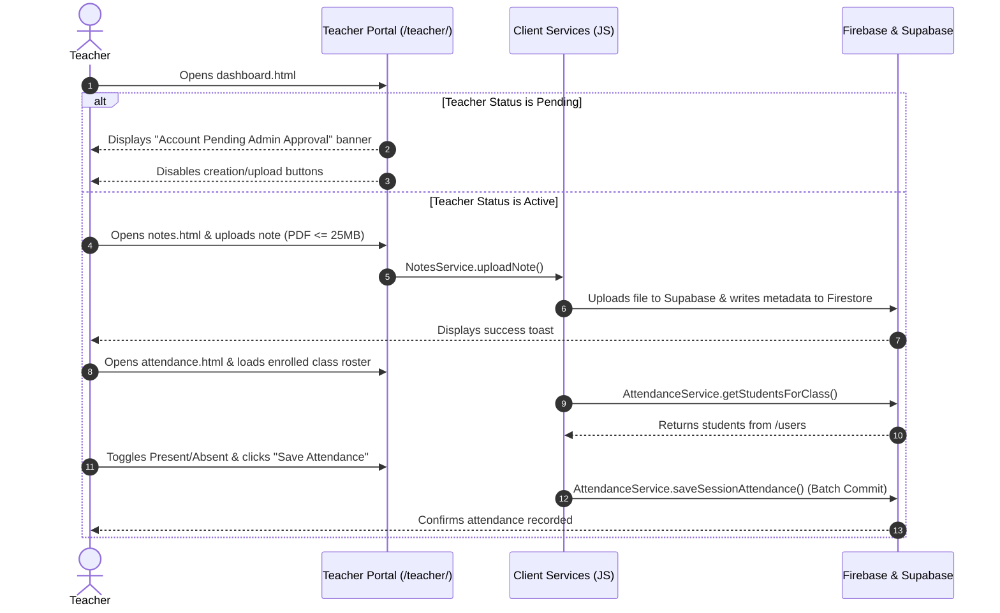

### Step-by-Step Execution:
1. Teacher logs in and is routed to `teacher/dashboard.html`.
2. If `status === "pending"`, an alert banner is displayed and write buttons are disabled.
3. Once approved, the teacher accesses `teacher/notes.html` to upload materials (requires title, subject, and file under 25 MB).
4. The file binary is uploaded to Supabase Storage at `notes/{noteId}/{fileName}`, and the document metadata is saved to Firestore.
5. In `teacher/assignments.html`, the teacher creates assignments with optional attachments and deadline dates, and inspects student submissions.
6. In `teacher/attendance.html`, the teacher selects class parameters, loads enrolled students from `/users`, marks statuses, and commits the batch to `/attendance`.
7. In `teacher/timetable.html`, the teacher views their weekly schedule filtered by `teacherId == auth.currentUser.uid`.

---

## 17. Admin Workflow

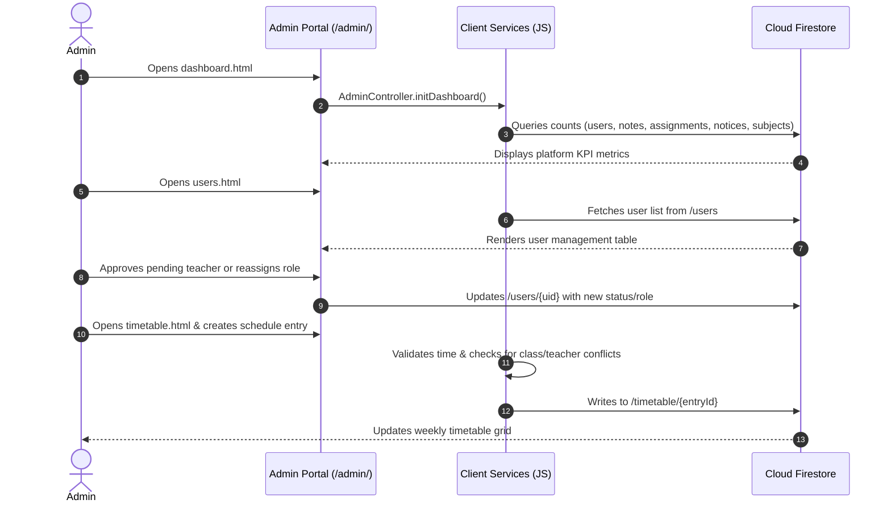

### Step-by-Step Execution:
1. Administrator signs in and navigates to `admin/dashboard.html`.
2. `admin.js` loads platform metrics: total students, faculty count, registered subjects, uploaded notes, active assignments, and published notices.
3. In `admin/users.html`, the admin filters users by role, promotes/demotes accounts, approves pending teachers, or suspends accounts.
4. In `admin/teachers.html`, the admin verifies faculty designations, cabin assignments, and account statuses.
5. In `admin/departments.html` and `admin/subjects.html`, the admin maintains academic departments and curriculum courses.
6. In `admin/timetable.html`, the admin manages weekly class schedules with double-conflict validation.
7. In `admin/content.html`, the admin inspects and moderates notes, assignments, notices, and student submissions across campus.

---

## 18. Notes Workflow

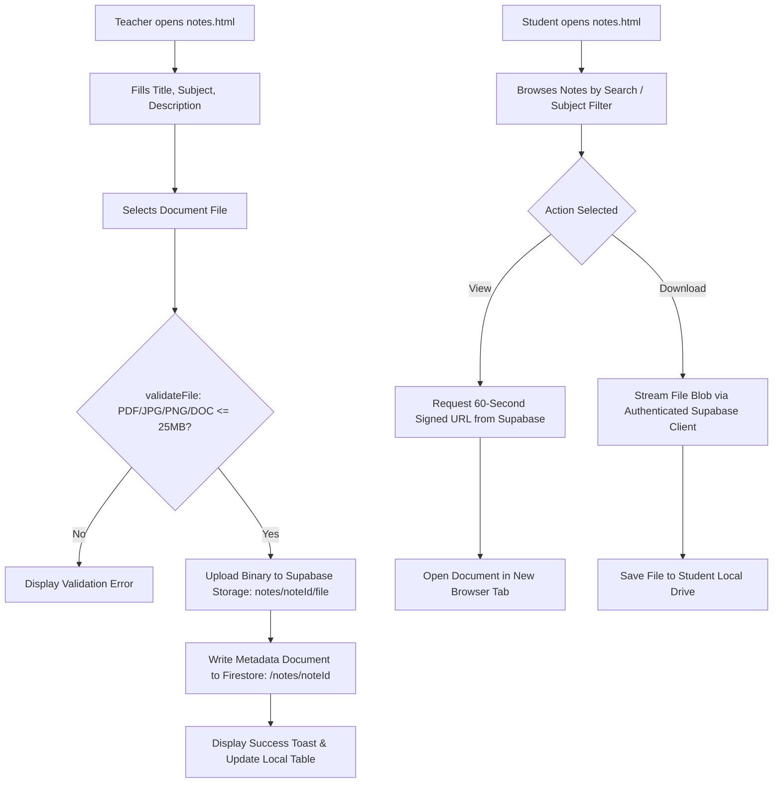

### Detailed Steps:
1. **Teacher Upload**:
   - Teacher fills in title, subject, and optional description, and attaches a document.
   - `NotesService.validateFile()` validates the format and enforces the 25 MB limit.
   - The file is uploaded to Supabase Storage at `notes/{noteId}/{fileName}`.
   - Document metadata (`title`, `subjectId`, `teacherId`, `storagePath`, `fileSize`, `createdAt`) is written to Firestore `/notes/{noteId}`.
2. **Student View & Download**:
   - Student filters notes by keyword or subject.
   - Clicking "View" calls `SupabaseClientService.viewFile(storagePath)`, which generates a 60-second signed URL and opens it in a new tab.
   - Clicking "Download" calls `SupabaseClientService.downloadFile(storagePath, fileName)`, which streams the file as a Blob to the browser.

---

## 19. Assignment Workflow

1. Faculty member opens `teacher/assignments.html`.
2. Faculty member inputs title, target department, target semester, target section, subject, deadline, priority level, and instructions.
3. Attaching a problem sheet file is **optional**. If selected, `AssignmentsService.validateFile()` checks the format and 25 MB size limit.
4. If a file is attached, it is uploaded to Supabase Storage at `assignments/{assignId}/{timestamp}.{ext}`.
5. The assignment record is saved to Firestore `/assignments/{assignId}`.
6. Students in the target department/semester receive the assignment on `student/assignments.html`.

---

## 20. Submission Workflow

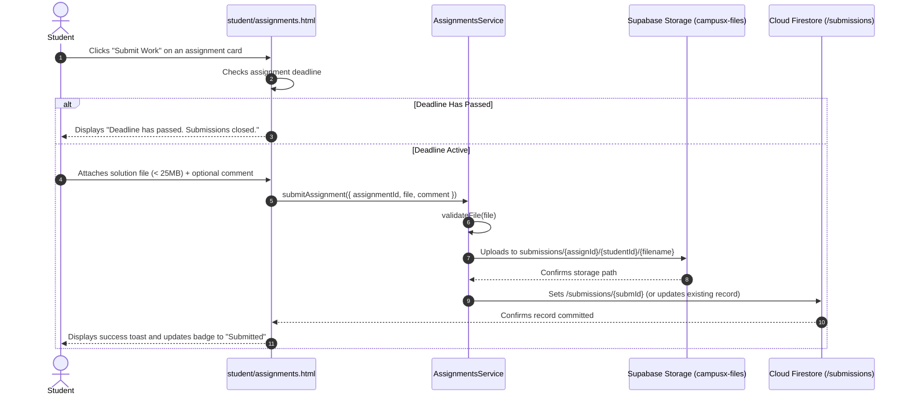

### Detailed Steps:
1. Student reviews assignments on `student/assignments.html`.
2. Student clicks "Submit Work" on an active coursework card.
3. System confirms that the deadline has not passed.
4. Student attaches their solution file (PDF, image, or document up to 25 MB) and adds an optional comment.
5. Solution binary is uploaded to Supabase Storage at `submissions/{assignmentId}/{studentId}/{uniqueFileName}`.
6. The submission record is written to Firestore `/submissions/{submissionId}` with `studentId`, `studentName`, `studentRoll`, `storagePath`, and timestamp.
7. If resubmitted before the deadline, the old storage file is cleaned up and the record is updated.
8. Teachers open the Submissions modal in `teacher/assignments.html` to review, view, and download submitted student work.

---

## 21. Attendance Workflow

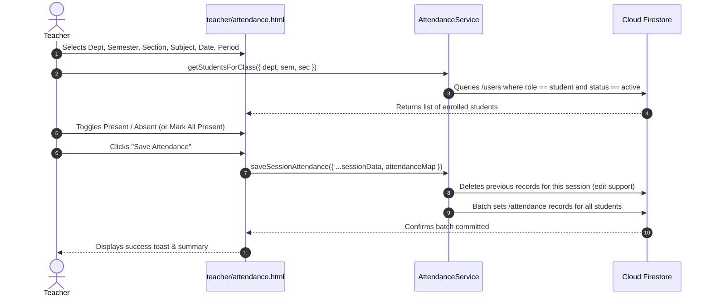

### Detailed Steps:
1. **Marking Attendance (Teacher)**:
   - Teacher selects department, semester, section, subject, date, and time period.
   - `AttendanceService.getStudentsForClass()` retrieves matching active students from `/users`.
   - Teacher marks each student as Present or Absent (or uses bulk buttons).
   - `saveSessionAttendance()` initiates a Firestore write batch: it clears any existing records for that session (supporting edits) and writes new attendance documents with server timestamps.
2. **Viewing & Projection (Student)**:
   - Student navigates to `student/attendance.html`.
   - `getMyAttendance(user.uid)` fetches all attendance records where `studentId == user.uid`.
   - `aggregateBySubject()` aggregates attended vs. total classes per subject.
   - `calculateProjection()` computes whether the student meets the statutory 75% rule:
     $$\text{Attendance Percentage} = \left(\frac{\text{Attended Classes}}{\text{Total Classes}}\right) \times 100$$
   - If below 75%, it calculates the consecutive classes required to reach compliance:
     $$\text{Classes Needed} = \left\lceil \frac{0.75 \times \text{Total} - \text{Attended}}{1 - 0.75} \right\rceil$$
   - If above 75%, it calculates safe bunks:
     $$\text{Safe Bunks} = \left\lfloor \frac{\text{Attended} - 0.75 \times \text{Total}}{0.75} \right\rfloor$$

---

## 22. Timetable Workflow

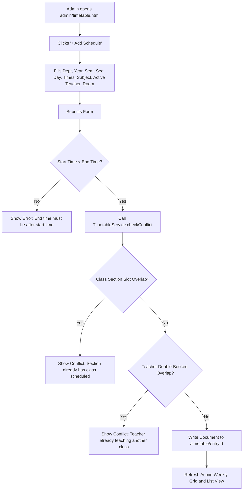

### Double-Conflict Detection Algorithm:
The conflict detection algorithm in `js/timetable.js` queries all timetable slots for the specified day and checks:
1. **Time Window Conversion**: Converts `HH:MM` time strings to minutes from midnight (0–1439). Validates that `endTime > startTime`.
2. **Interval Overlap Formula**: Two time slots $[S_1, E_1]$ and $[S_2, E_2]$ overlap if and only if:
   $$S_1 < E_2 \quad \text{and} \quad E_1 > S_2$$
3. **Class Section Conflict**: If an overlap occurs and Department, Semester, Section, and Academic Year match, the save operation is aborted.
4. **Teacher Conflict**: If an overlap occurs and `teacherId` matches an existing scheduled class on that day, the save operation is aborted.
5. **Exclusion Check**: When editing an existing entry, `excludeId` skips the current document to prevent false self-conflicts.

---

## 23. Notices & Circulars Workflow

1. Faculty or Administrator opens `teacher/notices.html` or `teacher/circulars.html`.
2. Author enters title, description, priority (`Normal`, `Important`, `Urgent`), target department, and optional file attachment.
3. If an attachment is included, `validateFile()` checks the format and 25 MB size limit.
4. The binary is uploaded to Supabase Storage at `notices/{noticeId}.{ext}` or `circulars/{circId}.{ext}`.
5. The metadata record is written to Firestore `/notices` or `/circulars`.
6. Students view announcements on `student/notices.html` and `student/circulars.html`, using signed URLs to view files or authenticated streams to download them.

---

## 24. Notification Workflow

1. System announcements and events are stored in the `/notifications` collection.
2. `NotificationService.getNotifications()` queries the collection on page load.
3. `updateUnreadBadges()` counts documents where `read == false` and updates badge indicators.
4. When a user clicks "Mark as Read" or "Mark All as Read", Firestore updates `read: true`. Under `firestore.rules`, active users are allowed to update **only** the `read` field on notification documents.

---

## 25. Authentication Workflow

1. User visits `login.html`.
2. User provides email and password or clicks "Continue with Google".
3. Firebase Authentication validates credentials and issues an identity JWT.
4. `AuthService.login()` fetches the user's document from `/users/{uid}`.
5. If `profile.status === "suspended"`, the session is terminated and an error is displayed.
6. The profile is saved to `sessionStorage`.
7. `guards.js` evaluates directory permissions and routes the user to their designated dashboard.

---

## 26. Registration & Teacher Approval Workflow

1. User visits `register.html` and selects their role (Student or Faculty).
2. User enters full name, college email, password, department, and role-specific fields (Student Roll/Semester or Faculty Title).
3. Firebase Auth creates the user account via `createUserWithEmailAndPassword`.
4. Document `/users/{uid}` is created:
   - For students: `role: "student"`, `status: "active"`.
   - For teachers: `role: "teacher"`, `status: "pending"`.
5. `user.sendEmailVerification()` sends a verification email.
6. When a pending teacher logs in, a top banner alerts them that administrative approval is required, and creation buttons are disabled.
7. An administrator reviews `admin/users.html` or `admin/teachers.html` and clicks "Approve", updating the status to `active` and enabling full faculty permissions.

---

## 27. File Upload & Download Workflow

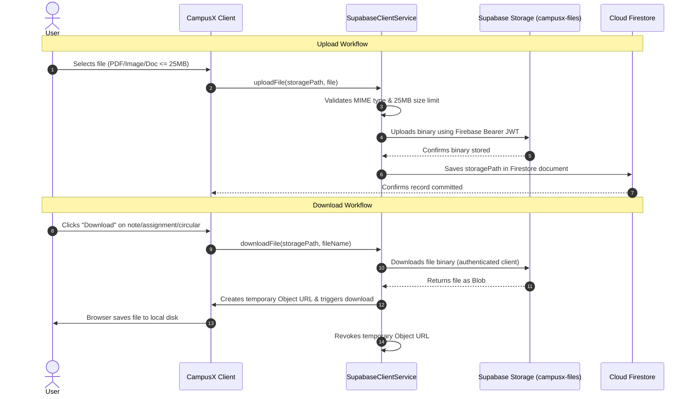

---

## 28. Role-Based Access Workflow

1. When a browser requests a page, `guards.js` executes immediately.
2. The guard inspects `window.location.pathname`:
   - Contains `/student/` $\rightarrow$ requires `student` (or `admin`).
   - Contains `/teacher/` $\rightarrow$ requires `teacher` (or `admin`).
   - Contains `/admin/` $\rightarrow$ requires `admin`.
3. If no session is found in `sessionStorage`, the user is redirected to `login.html`.
4. If a role mismatch occurs, `AuthService.redirectToRoleDashboard(profile.role)` redirects the user to their authorized portal.
5. If the account status is `suspended`, the session is terminated and the user is redirected to `login.html`.

---

## 29. Project Directory Structure

```
c:\Users\DELL\Desktop\mini project\
├── index.html                     # Public landing page with hero, features & role cards
├── login.html                     # Authentication portal & password reset modal
├── register.html                  # Student & Faculty registration form
├── firestore.rules                # Production Cloud Firestore security rules
├── storage.rules                  # Production Firebase Storage security rules (reference)
├── LICENSE                        # MIT License
├── README.md                      # Project documentation and guide
│
├── student/                       # Student Portal (11 pages)
│   ├── dashboard.html             # Academic KPIs, today's schedule, deadlines
│   ├── notes.html                 # Study notes search, filters & downloads
│   ├── assignments.html           # Coursework deadlines & digital submission portal
│   ├── attendance.html            # Subject attendance & statutory 75% predictor
│   ├── timetable.html             # Weekly schedule with active class indicator
│   ├── exams.html                 # Exam schedules, room allocations, marks
│   ├── notices.html               # College and departmental notices
│   ├── circulars.html             # Official administrative circulars
│   ├── planner.html               # Study task planner & Pomodoro focus timer
│   ├── notifications.html         # Alerts feed & unread counter badges
│   └── profile.html               # Academic record & editable personal bio
│
├── teacher/                       # Faculty Portal (9 pages)
│   ├── dashboard.html             # Faculty overview, KPIs & quick actions
│   ├── notes.html                 # Lecture notes manager (mandatory file upload)
│   ├── assignments.html           # Coursework creator & student submissions review
│   ├── attendance.html            # Session attendance marker with batch save
│   ├── timetable.html             # Faculty personal teaching schedule
│   ├── notices.html               # Department notice publisher
│   ├── circulars.html             # Official circular publisher
│   ├── students.html              # Enrolled students class roster
│   └── profile.html               # Faculty profile details
│
├── admin/                         # Administrator Portal (9 pages)
│   ├── dashboard.html             # Institutional metrics & recent users
│   ├── users.html                 # User directory, role promotion & status
│   ├── teachers.html              # Faculty verification & approval roster
│   ├── students.html              # Student directory & enrollment status
│   ├── departments.html           # Academic departments CRUD
│   ├── subjects.html              # Curriculum subjects configuration
│   ├── timetable.html             # Timetable manager with double-conflict validation
│   ├── content.html               # Central moderation of campus materials
│   └── settings.html              # Platform diagnostics & session settings
│
├── css/                           # Stylesheets (5 files)
│   ├── global.css                 # Color tokens, CSS reset, Light/Dark variables
│   ├── components.css             # Buttons, cards, badges, modals, toasts, tables
│   ├── dashboard.css              # Sidebar, topbar, KPI cards, Pomodoro dial
│   ├── auth.css                   # Auth forms, role tabs, password toggle
│   └── responsive.css             # Mobile drawer, responsive tables, media queries
│
├── js/                            # JavaScript Controllers & Services (17 files)
│   ├── firebase-config.js         # Firebase App, Auth, Firestore initialization
│   ├── supabase-config.js         # Supabase client, JWT adapter, file operations
│   ├── auth.js                    # Login, registration, Google OAuth, password reset
│   ├── guards.js                  # Client route protection & UI state sync
│   ├── notes.js                   # Notes Firestore CRUD & Supabase storage
│   ├── assignments.js             # Coursework management & student submission engine
│   ├── attendance.js              # Session marking, personal analytics, 75% formula
│   ├── timetable.js               # Schedule queries, conflict detection, live class tracker
│   ├── notices.js                 # Notices management with optional file upload
│   ├── circulars.js               # Circulars management with optional file upload
│   ├── notifications.js           # Notification store & unread counter handlers
│   ├── planner.js                 # Local task manager & Pomodoro timer engine
│   ├── student.js                 # Student portal dashboard controller
│   ├── teacher.js                 # Faculty portal dashboard controller
│   ├── admin.js                   # Admin portal dashboard controller
│   ├── theme.js                   # Light/Dark mode switcher with LocalStorage
│   └── utils.js                   # Toast notifications, modal helpers, sanitizers
│
└── docs/
    └── COLLEGE_PROJECT_REPORT.md  # Comprehensive academic project report (B.Tech)
```

---

## 30. Firestore Collections / Data Model

The following table documents all Firestore collections confirmed in the CampusX source code:

| Collection Name | Purpose | Primary Fields | Read Permissions | Create Permissions | Update Permissions | Delete Permissions |
|---|---|---|---|---|---|---|
| **`users`** | User profile, roles, and account status | `uid`, `email`, `displayName`, `role`, `status`, `department`, `studentId`, `semester`, `avatar`, `createdAt` | Own profile, Admin (all), Active Teacher (students), Active Users (teachers) | Self (Student: `active`, Teacher: `pending`, never Admin) | Admin (all), Self (non-protected fields only) | Admin only |
| **`notes`** | Study materials & lecture notes metadata | `title`, `subjectId`, `subjectName`, `teacherId`, `teacherName`, `description`, `fileName`, `storagePath`, `fileSize`, `createdAt` | Active Authenticated users | Active Teachers & Admins (`teacherId == auth.uid`) | Note owner & Admin | Note owner & Admin |
| **`assignments`** | Coursework assignments & problem sheets | `title`, `department`, `semester`, `section`, `subjectId`, `subjectName`, `teacherId`, `deadline`, `priority`, `storagePath`, `attachmentName` | Active Authenticated users | Active Teachers & Admins (`teacherId == auth.uid`) | Assignment owner & Admin | Assignment owner & Admin |
| **`submissions`** | Student coursework submissions | `assignmentId`, `studentId`, `studentName`, `studentRoll`, `fileName`, `storagePath`, `comment`, `submittedAt`, `status` | Student owner (`studentId == auth.uid`), Active Teachers, Admins | Student owner (`studentId == auth.uid` & `isStudent()`) | Student owner (own UID), Active Teachers, Admins | Admin only |
| **`attendance`** | Individual student attendance session records | `studentId`, `studentName`, `department`, `semester`, `section`, `subjectId`, `subjectName`, `date`, `period`, `status`, `markedBy`, `markedAt` | Student owner (`studentId == auth.uid`), Active Teachers, Admins | Active Teachers & Admins | Active Teachers & Admins | Active Teachers & Admins |
| **`timetable`** | Weekly recurring class schedules | `department`, `semester`, `section`, `academicYear`, `day`, `startTime`, `endTime`, `subjectId`, `subjectName`, `teacherId`, `room`, `type`, `notes` | Active Authenticated users | Admin only | Admin only | Admin only |
| **`notices`** | Departmental & college announcements | `title`, `description`, `departmentId`, `departmentName`, `priority`, `attachmentName`, `storagePath`, `createdBy`, `createdAt` | Active Authenticated users | Active Teachers & Admins | Active Teachers & Admins | Active Teachers & Admins |
| **`circulars`** | Official institutional administrative circulars | `title`, `description`, `department`, `issuedBy`, `date`, `attachmentName`, `storagePath`, `createdAt` | Active Authenticated users | Active Teachers & Admins | Active Teachers & Admins | Active Teachers & Admins |
| **`departments`** | Academic college departments | `id`, `name`, `code`, `head`, `totalStudents` | Active Authenticated users | Admin only | Admin only | Admin only |
| **`subjects`** | Academic syllabus courses & subjects | `id`, `code`, `name`, `semester`, `departmentId`, `teacherName` | Active Authenticated users | Admin only | Admin only | Admin only |
| **`exams`** | Examination schedules, rooms, and marks | `subject`, `code`, `title`, `type`, `date`, `time`, `room`, `totalMarks` | Active Authenticated users | Admin only | Admin only | Admin only |
| **`notifications`**| System alert messages & read flags | `title`, `message`, `type`, `targetRole`, `read`, `createdAt` | Active Authenticated users | Active Teachers & Admins | Active users (`read` field only), Teachers/Admins (full) | Active Teachers & Admins |

---

## 31. Supabase Storage Architecture

- **Bucket Name**: `campusx-files`
- **Bucket Access Mode**: Completely **PRIVATE** (public URL access is disabled).
- **Authentication Bridge**: Supabase Storage utilizes Firebase Authentication tokens. When a user logs in, `user.getIdToken()` retrieves the signed JWT, which is passed in the request header as `Authorization: Bearer <idToken>`.
- **Viewing Files**: `SupabaseClientService.viewFile(storagePath)` requests a 60-second time-limited signed URL via `createSignedUrl(path, 60)` and opens it in a new browser tab.
- **Downloading Files**: `SupabaseClientService.downloadFile(storagePath, fileName)` downloads the file as a Blob through the authenticated channel and streams it to the user's disk using a temporary Object URL.
- **Allowed MIME Types**:
  - `application/pdf` (`.pdf`)
  - `image/jpeg` (`.jpg`, `.jpeg`)
  - `image/png` (`.png`)
  - `application/msword` (`.doc`)
  - `application/vnd.openxmlformats-officedocument.wordprocessingml.document` (`.docx`)
- **File Size Limit**: Enforced at **25 MB** (`25 * 1024 * 1024` bytes).

---

## 32. Firebase Security Rules

The security perimeter in `firestore.rules` enforces granular access control across collections:
- **Authentication Check**: `request.auth != null`.
- **Role Helpers**: Look up the authenticated user's record in `/users/$(request.auth.uid)`:
  - `isActive()`: Verifies `status == 'active'`.
  - `isAdmin()`: Verifies `role == 'admin'` and active status.
  - `isTeacher()`: Verifies `role == 'teacher'` (active) or `isAdmin()`.
  - `isStudent()`: Verifies `role == 'student'` and active status.
- **User Record Restrictions**: Users can update their own profile, but cannot change sensitive fields:
  ```javascript
  !request.resource.data.diff(resource.data).affectedKeys().hasAny([
    'role', 'status', 'email', 'uid', 'approvedBy', 'approvedAt', 'createdAt'
  ])
  ```
- **Student Data Isolation**: Students can access only submissions and attendance records matching `studentId == request.auth.uid`.
- **Administrative Exclusivity**: Managing timetable slots, creating departments, and configuring subjects require `isAdmin()`.

---

## 33. Storage Security Rules

The storage rules in `storage.rules` (configured for cloud storage matching) enforce:
- **Maximum File Size**: Validated using `request.resource.size < 25 * 1024 * 1024` (25 MB).
- **Notes Storage (`/notes/{noteId}/{fileName}`)**: Read access is granted to active users; create/update/delete access is restricted to active teachers and administrators.
- **Assignment Attachments (`/assignments/{assignId}/{fileName}`)**: Read access is granted to active users; write access is restricted to active teachers and administrators.
- **Student Submissions (`/submissions/{assignId}/{studentId}/{fileName}`)**: Upload access is granted only to active students where `request.auth.uid == studentId`; read access is granted to the student owner and active teachers; delete access is restricted to administrators.

---

## 34. Deployment Architecture

```
Developer Workspace (Local Machine)
         │
         ▼  git push origin main
GitHub Repository (Version Control)
         │
         ▼  Webhook Trigger / Zero-Config Static Build
Vercel Edge Network (Global CDN Deployment)
         │
         ▼
Live Production Application
URL: https://campusx-7cxs-esdg6sqbw-self-coders.vercel.app/
         │
         ├─────────────────────────────────────────────┐
         ▼                                             ▼
Google Firebase Cloud Services                 Supabase Storage
├── Firebase Authentication                    └── campusx-files Bucket
│   (User Identity & JWT Tokens)                   (Private Academic Documents)
└── Cloud Firestore Database
    (Application Metadata & Security Rules)
```

### Environment Responsibilities:
1. **Local Development**: Developer runs standard HTTP servers (`python -m http.server` or `npx serve`) to preview changes in modern browsers.
2. **GitHub Repository**: Stores source code, tracks version history, and triggers automated deployment webhooks.
3. **Vercel CDN**: Distributes static HTML5, CSS3, and JavaScript files to global edge locations with SSL/TLS encryption.
4. **Firebase Cloud Backend**: Manages identity validation and persistent application state.
5. **Supabase Cloud Storage**: Stores binary files securely in a private S3-compatible bucket.

---

## 35. Testing Strategy

### 35.1 Automated Syntax Validation
All JavaScript controllers and service modules are validated using the Node.js syntax engine:
```bash
node -e "['js/timetable.js','js/student.js','js/admin.js','js/teacher.js','js/assignments.js','js/attendance.js','js/notes.js','js/notices.js','js/circulars.js','js/auth.js','js/guards.js'].forEach(f => new Function(require('fs').readFileSync(f, 'utf8')))"
```
*Result: 0 syntax errors detected.*

### 35.2 Manual Functional Test Cases

| Test Case ID | Feature / Flow | Input / Action | Expected Result | Actual Result | Status |
|---|---|---|---|---|---|
| **TC-01** | Student Registration | Register with valid name, email, password, dept, roll number | Account created, status set to `active`, verification email dispatched | As expected | **PASS** |
| **TC-02** | Faculty Registration | Register with designation, dept, faculty credentials | Account created with status `pending`, write controls disabled | As expected | **PASS** |
| **TC-03** | Faculty Approval | Admin opens `admin/users.html` and clicks "Approve" | Status updated to `active`, faculty write controls enabled | As expected | **PASS** |
| **TC-04** | Route Guard Protection | Student navigates directly to `/admin/dashboard.html` | `guards.js` intercepts URL and redirects to `student/dashboard.html` | As expected | **PASS** |
| **TC-05** | Notes Upload Size Limit | Teacher uploads file > 25 MB | `validateFile()` throws "File size exceeds the 25 MB maximum limit" | As expected | **PASS** |
| **TC-06** | Notes Upload Valid | Teacher uploads PDF <= 25 MB | File uploaded to Supabase, metadata saved to Firestore | As expected | **PASS** |
| **TC-07** | Student Notes Download | Student clicks "Download" on note | Supabase client streams Blob and browser saves file | As expected | **PASS** |
| **TC-08** | Timetable Section Conflict | Admin schedules overlapping class for same section/day | System rejects save with class section conflict message | As expected | **PASS** |
| **TC-09** | Timetable Teacher Conflict | Admin schedules overlapping class for same teacher/day | System rejects save with teacher conflict message | As expected | **PASS** |
| **TC-10** | Assignment Submission | Student uploads PNG solution file before deadline | File saved to Supabase, submission record stored in Firestore | As expected | **PASS** |
| **TC-11** | Overdue Submission | Student attempts submission after assignment deadline | System rejects submission with deadline expired notice | As expected | **PASS** |
| **TC-12** | Attendance Calculation | Student with 14/20 classes (70%) views attendance | Predictor displays shortage warning and calculates 4 consecutive classes needed | As expected | **PASS** |
| **TC-13** | Pomodoro Audio Chime | Timer counts down to 00:00 | Web Audio API synthesizes two-tone chime without external audio assets | As expected | **PASS** |

---

## 36. Current Implementation Status

All core modules specified in the project scope have been implemented, integrated, and deployed:
- ✅ Public Landing Page, Login, Registration, and Password Reset Modals.
- ✅ Student Portal with 11 functional views (Dashboard, Notes, Assignments, Attendance, Timetable, Exams, Notices, Circulars, Planner, Notifications, Profile).
- ✅ Faculty Portal with 9 functional views (Dashboard, Notes Manager, Coursework Creator, Attendance Marker, My Schedule, Notices, Circulars, Student Roster, Profile).
- ✅ Administrator Portal with 9 functional views (Dashboard, Users & Roles, Faculty Roster, Student Directory, Departments, Subjects, Timetable Manager, Content Moderation, Settings).
- ✅ Dual Conflict Validation on Timetable Scheduling.
- ✅ Private Supabase Storage Integration with Firebase JWT Bearer authentication.
- ✅ Statutory 75% Attendance Predictor and Consecutive Class Formula.
- ✅ Zero-Dependency Pomodoro Timer with Web Audio API chime synthesis.
- ✅ Production deployment on Vercel Edge Network.

---

## 37. Limitations

1. **Client-Side File Validation**: Initial validation relies on browser MIME types and extensions before upload.
2. **Third-Party Auth Dependency**: Supabase Storage authorization depends on forwarding valid Firebase ID tokens in request headers.
3. **No Native Web Push Service Worker**: Alerts and notifications are stored in Firestore and checked in-app; native background OS push notifications are not yet integrated.
4. **Client-Side Offline Caching**: Browser caching preserves static UI assets, but offline write queuing is limited by browser connectivity.

---

## 38. Future Enhancements

1. **Automated Thumbnail Previews**: Deploy a Firebase Cloud Function to render image thumbnails for uploaded lecture notes and slides.
2. **Web Push API Integration**: Register a Service Worker to send background browser notifications for urgent circulars and upcoming assignment deadlines.
3. **Automated Attendance Scanning**: Use Optical Character Recognition (OCR) to extract student attendance data from physical paper registers.
4. **Digital Fee Payment Gateway**: Integrate Razorpay or Stripe to support online semester fee payments.
5. **Native Mobile Shell**: Package the responsive web application for Android and iOS using Capacitor or React Native.

---

## 39. Conclusion

CampusX demonstrates that a robust, multi-tenant collegiate management system can be engineered with high responsiveness, clean separation of concerns, and zero compiled framework dependencies. By combining semantic HTML5, CSS3 Custom Properties, and Vanilla JavaScript with a hybrid cloud architecture (Google Firebase Authentication, Cloud Firestore, and private Supabase Storage), the platform eliminates traditional server maintenance overhead.

The platform provides dedicated, role-tailored portals for Students, Faculty Members, and Administrators while enforcing security across client route guards, Firestore security rules, and private storage policies. Features such as double-conflict timetable validation, automated 75% attendance predictions, and digital assignment submission workflows make CampusX a comprehensive, modern solution for collegiate academic administration.

---

## 40. Technical Terms & Full Forms

| Term | Full Form | Meaning in CampusX |
|---|---|---|
| **API** | Application Programming Interface | The set of programmatic functions and protocols used to communicate between application services (e.g. Supabase Storage API, Web Audio API). |
| **BaaS** | Backend-as-a-Service | Cloud services (Firebase, Supabase) providing backend database, authentication, and storage infrastructure without custom server maintenance. |
| **CDN** | Content Delivery Network | Globally distributed network of edge servers (Vercel) delivering web application files with minimal latency. |
| **CRUD** | Create, Read, Update, Delete | The four fundamental persistent data operations supported across all CampusX modules. |
| **CSS** | Cascading Style Sheets | Style sheet language used to format the layout, colors, and responsive presentation of CampusX. |
| **DFD** | Data Flow Diagram | Graphical representation of the flow of data through the CampusX system. |
| **DOM** | Document Object Model | Browser programming interface for HTML documents manipulated directly by Vanilla JavaScript. |
| **ER** | Entity Relationship | Data modeling framework representing entities, attributes, and relationships in CampusX. |
| **HTML** | HyperText Markup Language | The standard markup language used to structure CampusX web pages. |
| **HOD** | Head of Department | Senior faculty member leading an academic department configured in CampusX. |
| **JWT** | JSON Web Token | Compact, URL-safe cryptographic token issued by Firebase Auth and sent to Supabase Storage for bearer authorization. |
| **KPI** | Key Performance Indicator | High-level metrics displayed on portals (e.g. attendance percentage, enrolled student count). |
| **MIME** | Multipurpose Internet Mail Extensions | Standard indicating the nature and format of a file (e.g. `application/pdf`). |
| **NoSQL** | Not Only SQL | Non-relational database architecture implemented by Google Cloud Firestore. |
| **OAuth** | Open Authorization | Open standard protocol enabling secure federated third-party login (e.g. Google Sign-In). |
| **PDF** | Portable Document Format | The standard document format supported for study notes, assignments, notices, and circulars. |
| **RBAC** | Role-Based Access Control | Access control mechanism restricting system features based on user role (`student`, `teacher`, `admin`). |
| **RLS** | Row Level Security | Database and storage security policies governing access to individual records or files. |
| **SDK** | Software Development Kit | Collection of software development tools and libraries provided by Firebase and Supabase. |
| **UI** | User Interface | The visual, interactive front-facing screens of the CampusX application. |
| **UID** | User Identifier | Unique alphanumeric string assigned to each user by Firebase Authentication. |
| **URL** | Uniform Resource Locator | The global web address referencing pages or documents in CampusX. |
| **XSS** | Cross-Site Scripting | Web security vulnerability mitigated across CampusX using input sanitization (`sanitizeHtml`). |
