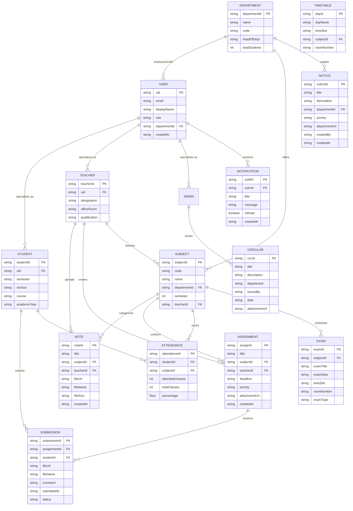
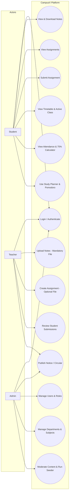

# ACADEMIC PROJECT REPORT: CAMPUSX
## A Centralized Web-Based College Management & Student Engagement Platform

---

### **TABLE OF CONTENTS**
1. [Abstract](#1-abstract)
2. [Introduction](#2-introduction)
3. [Problem Statement](#3-problem-statement)
4. [Objectives](#4-objectives)
5. [Existing System](#5-existing-system)
6. [Proposed System](#6-proposed-system)
7. [Scope](#7-scope)
8. [Feasibility Study](#8-feasibility-study)
9. [Functional Requirements](#9-functional-requirements)
10. [Non-Functional Requirements](#10-non-functional-requirements)
11. [Hardware Requirements](#11-hardware-requirements)
12. [Software Requirements](#12-software-requirements)
13. [Technology Stack](#13-technology-stack)
14. [System Architecture](#14-system-architecture)
15. [Module Description](#15-module-description)
16. [Database Design](#16-database-design)
17. [Entity Relationship (ER) Diagram](#17-entity-relationship-er-diagram)
18. [Data Flow Diagram (DFD) Level 0](#18-data-flow-diagram-dfd-level-0)
19. [Data Flow Diagram (DFD) Level 1](#19-data-flow-diagram-dfd-level-1)
20. [Use Case Diagram & Actor Specifications](#20-use-case-diagram--actor-specifications)
21. [Data Dictionary](#21-data-dictionary)
22. [Testing Methodology](#22-testing-methodology)
23. [Test Cases](#23-test-cases)
24. [User Interface Design Specifications & Screenshots](#24-user-interface-design-specifications--screenshots)
25. [Advantages of CampusX](#25-advantages-of-campusx)
26. [Limitations](#26-limitations)
27. [Future Scope](#27-future-scope)
28. [Conclusion](#28-conclusion)
29. [References](#29-references)

---

## 1. Abstract
The modern collegiate ecosystem suffers from administrative fragmentation, where students, faculty, and administrators rely on disjointed channels such as disparate messaging groups, bulletin boards, and offline paperwork. **CampusX** ("One Campus. One Platform. Everything Students Need.") is a full-stack, cloud-native web application designed to centralize academic management and foster scholastic productivity. Built using semantic HTML5, modern CSS3 variables, Vanilla JavaScript (ES6+), and Google Firebase (Authentication, Cloud Firestore, and Cloud Storage), the application delivers three role-tailored portals (Student, Faculty, Administrator). Key capabilities include verified notes distribution with cloud storage, assignment submission pipelines, real-time notices and circulars with optional file attachments, live class timetables, attendance analytics featuring predictive 75% rule calculations, and personal productivity utilities (Study Planner and Pomodoro Timer). The system enforces strict Role-Based Access Control (RBAC) across client route guards and serverless Firebase security rules, resulting in an accessible, zero-maintenance, and resilient campus platform.

---

## 2. Introduction
Higher educational institutions handle substantial volumes of dynamic information daily, ranging from lecture notes and assignment deadlines to statutory attendance tracking and urgent institutional circulars. In traditional setups, students face significant communication delays, miss assignment deadlines, and struggle to keep track of their attendance eligibility.

CampusX is developed as a collegiate SaaS-style web platform that bridges students, instructors, and administrative leaders into a unified real-time workflow. By utilizing client-side asynchronous execution paired with Google Firebase BaaS (Backend-as-a-Service), the platform eliminates costly backend server maintenance while delivering immediate data synchronicity, cloud storage capabilities, and responsive access across desktop, laptop, tablet, and mobile browsers.

---

## 3. Problem Statement
The contemporary academic workflow exhibits several persistent issues:
1. **Scattered Resources**: Study materials and notes are distributed across chat groups, personal drives, and physical handouts, leading to version confusion and lost documents.
2. **Assignment Inefficiencies**: Manual submission of programming assignments, technical reports, and lab exercises results in grading delays and missing audit trails.
3. **Attendance Opacity & University 75% Compliance**: Students lack automated, real-time insights into their attendance status and cannot calculate whether they meet the statutory 75% examination threshold.
4. **Disjointed Communication**: Physical bulletin boards and uncoordinated emails fail to deliver urgent notifications (such as exam schedules or schedule adjustments) promptly.
5. **Productivity Fragmentation**: Students frequently toggle between academic portals and third-party task/timer apps to manage their daily study schedules.

---

## 4. Objectives
The primary objectives of the CampusX application are:
* **Centralization**: Provide a single authenticated portal for academic materials, assignments, timetables, and notices.
* **Role-Based Workflows**: Tailor dedicated portals for Students, Faculty Members, and Academic Administrators with granular permissions.
* **Efficient Cloud File Management**: Decouple document binary storage (Firebase Storage) from metadata records (Firestore) for fast querying and low bandwidth overhead.
* **Smart Attendance Analytics**: Implement predictive modeling to compute classes needed to satisfy university 75% rules or calculate safe bunks.
* **Productivity Integration**: Embed a student task planner and Pomodoro timer within the academic environment.
* **High Usability & Modern UI**: Deliver a responsive SaaS interface with Dark/Light modes, toast notifications, skeleton loaders, and touch-friendly layouts.

---

## 5. Existing System
In existing collegiate setups:
* Notices are physically posted on notice boards or circulated informally via social messaging applications.
* Teachers email PDF notes or distribute paper photocopies, causing document loss and version discrepancies.
* Submissions are collected physically on paper or via unstructured email inboxes without central tracking.
* Attendance is recorded in paper registers and tabulated only at the end of the term, leaving students unaware of attendance shortages until hall tickets are withheld.
* Administration lacks a consolidated dashboard to monitor campus-wide academic operations.

---

## 6. Proposed System
CampusX modernizes collegiate operations through:
* **Automated Cloud Hub**: A secure web application accessible 24/7 on any device.
* **Structured Document Pipeline**: Direct upload of PDF, DOCX, and presentation slides to Firebase Cloud Storage, linked via Firestore metadata.
* **Integrated Submissions**: Students submit assignments with digital files and comments; teachers inspect student rosters and download solutions on demand.
* **Predictive Attendance Engine**: Instantly visualizes subject attendance with color-coded safety badges and computes exact classes needed to regain exam eligibility.
* **Live Schedule Tracker**: Parses the weekly timetable to highlight today's classes and dynamically display the currently active lecture and the next upcoming class.
* **Campus Productivity Tools**: Client-persisted study planner and Pomodoro focus timer with Web Audio API chime notifications.

---

## 7. Scope
* **Users**: Students, Teachers/Faculty, and Academic Administrators.
* **Academic Spectrum**: Engineering, Sciences, Arts, and Management colleges requiring centralized coursework and communication.
* **Deployment Scope**: Browser-accessible web application deployed on Firebase Hosting or standard static servers with real-time cloud data storage.

---

## 8. Feasibility Study
* **Technical Feasibility**: Built with HTML5, CSS3, ES6+ JavaScript, and Firebase SDK 10.x. No heavy frontend framework compilation (React/Angular/Node backend) is required, ensuring universal browser compatibility and zero build configuration overhead.
* **Operational Feasibility**: Highly intuitive SaaS dashboard with familiar navigation patterns, responsive mobile drawers, and accessible color contrasts. Minimal training is required for faculty and students.
* **Economic Feasibility**: Utilizes Firebase's generous Free Tier (Spark Plan) covering 50,000 daily Firestore reads, 20,000 writes, 5 GB of cloud storage, and free SSL hosting. Operational hosting costs for standard college mini-projects are zero.

---

## 9. Functional Requirements
* **FR-01 (Authentication)**: Secure email/password login, registration with role selection (Student/Faculty), password reset, and session management.
* **FR-02 (Role Routing & Authorization)**: Route guards to prevent cross-portal access (students cannot enter faculty or admin pages).
* **FR-03 (Study Notes Management)**: Faculty can upload lecture notes with mandatory file validation (<25MB); students can search, filter by subject, and download notes.
* **FR-04 (Assignments & Submissions)**: Faculty can create assignments with optional file attachments; students can submit solutions with attached files and remarks.
* **FR-05 (Notices & Circulars)**: Faculty/Admins can post notices with optional attachments and priority levels (`Normal`, `Important`, `Urgent`).
* **FR-06 (Timetable Tracker)**: Displays weekly schedule with live indicators for the current lecture based on system time.
* **FR-07 (Attendance & Predictor)**: Displays subject percentages and calculates required classes or safe bunks based on the 75% rule.
* **FR-08 (Productivity Planner)**: Task manager and Pomodoro timer (25 min focus, 5 min short break, 15 min long break) with audio chimes.
* **FR-09 (Admin Controls)**: User directory management, role promotion, department and subject management, and 1-click database seeding.

---

## 10. Non-Functional Requirements
* **Performance**: Sub-second page rendering; lightweight DOM footprint; binary assets offloaded to CDN-backed Firebase Storage.
* **Security**: Role-Based Access Control enforced at both JavaScript route guards and Firestore/Storage security rules. Passwords hashed and managed by Firebase Auth.
* **Reliability & Availability**: 99.95% uptime powered by Google Cloud infrastructure.
* **Usability & Responsiveness**: Mobile-first design; Dark and Light mode options persisted in LocalStorage; accessible ARIA labeling.

---

## 11. Hardware Requirements
* **Client / End-User**:
  * Processor: Dual Core 1.6 GHz or higher.
  * RAM: 2 GB minimum (4 GB recommended).
  * Storage: 100 MB free space (standard web browser cache).
  * Display: 360px (mobile) to 1920x1080 (desktop).
* **Server / Host**:
  * Serverless cloud architecture hosted on Google Cloud infrastructure.

---

## 12. Software Requirements
* **Operating System**: Windows 10/11, macOS, Linux, Android, or iOS.
* **Web Browser**: Google Chrome 90+, Mozilla Firefox 88+, Safari 14+, or Microsoft Edge.
* **Backend Services**: Google Firebase Cloud Firestore, Firebase Auth, and Firebase Storage.
* **Development Tools**: Visual Studio Code, Git, and Live Server.

---

## 13. Technology Stack
* **Frontend**: HTML5 (Semantic Structure), CSS3 (Custom Properties & Flexbox/Grid), Vanilla JavaScript (ES6+ Modules, Async/Await).
* **Authentication**: Firebase Authentication (Email/Password Identity Provider).
* **Database**: Cloud Firestore (NoSQL Document Store with real-time capabilities).
* **File Storage**: Google Firebase Storage (Blob/Binary storage with public HTTPS download tokens).
* **Audio Synthesis**: Native HTML5 Web Audio API (for zero-dependency Pomodoro timer chimes).

---

## 14. System Architecture

```
+-------------------------------------------------------------------------+
|                          CLIENT PRESENTATION TIER                       |
|  +---------------------+  +---------------------+  +-----------------+  |
|  |   Student Portal    |  |    Teacher Portal   |  |   Admin Portal  |  |
|  | - Dashboard         |  | - Notes Manager     |  | - Users & Roles |  |
|  | - Notes Repository  |  | - Assignment Creator|  | - Departments   |  |
|  | - Submissions Modal |  | - Submissions View  |  | - Subjects      |  |
|  | - Timetable Tracker |  | - Notice Publisher  |  | - Moderation    |  |
|  | - 75% Calculator    |  | - Student Roster    |  | - DB Seeder     |  |
|  | - Pomodoro & Tasks  |  +---------------------+  +-----------------+  |
|  +---------------------+                                                |
+-------------------------------------------------------------------------+
                                    |
                    Route Guards & Client Controllers
                                    |
+-------------------------------------------------------------------------+
|                        FIREBASE CLOUD BACKEND TIER                      |
|  +-------------------------+  +---------------------------------------+  |
|  | Firebase Authentication |  | Cloud Firestore (Document Metadata)  |  |
|  | - User identity tokens  |  | - users, notes, assignments, notices  |  |
|  | - Role claims validation|  | - submissions, timetable, attendance  |  |
|  +-------------------------+  +---------------------------------------+  |
|                                                                         |
|  +-------------------------------------------------------------------+  |
|  | Firebase Cloud Storage (Binary Asset Tier)                        |  |
|  | - Lecture PDFs, DOCX problem sheets, Student Solution Code        |  |
|  | - Path: notes/{id}/*, assignments/{id}/*, submissions/{id}/*      |  |
|  +-------------------------------------------------------------------+  |
|                                                                         |
|  +-------------------------------------------------------------------+  |
|  | Security Perimeter: firestore.rules & storage.rules                |  |
|  +-------------------------------------------------------------------+  |
+-------------------------------------------------------------------------+
```

---

## 15. Module Description
1. **Authentication & Authorization**: Validates user credentials, fetches assigned role (`student`, `teacher`, `admin`), and redirects to the appropriate portal.
2. **Notes Module**: Enforces required document upload for faculty; provides search, subject filtering, and downloads for students.
3. **Assignments & Submissions**: Supports optional teacher attachments; enables student solution uploads with status tracking (`Pending`, `Submitted`, `Overdue`).
4. **Notices & Circulars**: Broadcasts department or campus-wide announcements with priority indicators (`Normal`, `Important`, `Urgent`).
5. **Timetable Module**: Weekly schedule viewer that identifies the active lecture and upcoming classes based on the clock time.
6. **Attendance & Predictive Calculator**: Tracks subject-wise attendance and computes attendance adjustments to satisfy the 75% rule.
7. **Productivity Module**: Personal study task manager with an interactive Pomodoro focus timer and Web Audio API chime notifications.
8. **Admin & Database Seeder**: Platform KPIs, user directory management, and a 1-click database seeder to populate test data into Firestore.

---

## 16. Database Design
Cloud Firestore stores data across 12 structured collections:
* `users`: Academic identity, roles, department, roll numbers, and contact details.
* `departments`: Academic branches, department codes, and assigned HODs.
* `subjects`: Subject codes, course titles, semesters, and instructors.
* `notes`: Metadata of uploaded study notes pointing to Firebase Storage URLs.
* `assignments`: Coursework problem statements, deadlines, priorities, and optional attachment URLs.
* `submissions`: Student solution files, submission timestamps, and optional student remarks.
* `notices`: Institutional notices with priority tags and target department IDs.
* `circulars`: Administrative directives, issuance dates, and attachments.
* `timetable`: Daily lecture schedules, time slots, room numbers, and instructor references.
* `attendance`: Subject-wise attended and conducted lecture counts.
* `exams`: Examination schedules, room allocations, and timings.
* `notifications`: Real-time alerts with read/unread statuses.

---

## 17. Entity Relationship (ER) Diagram



---

## 18. Data Flow Diagram (DFD) Level 0

```
  +-------------+                       +-------------+
  |             |                       |             |
  |   STUDENT   |                       |   TEACHER   |
  |             |                       |             |
  +------+------+                       +------+------+
         |                                     |
         | Submissions, Notes Download,        | Upload Notes, Post Assignments,
         | Timetable, Attendance, Planner      | Notices, Review Submissions
         v                                     v
   +-------------------------------------------------+
   |                                                 |
   |              CAMPUSX WEB PLATFORM               |
   |                 (Process 0.0)                   |
   |                                                 |
   +------------------------+------------------------+
                            ^
                            | User Directory, Curriculums,
                            | System Config, Seeder
                            |
                     +------+------+
                     |             |
                     |    ADMIN    |
                     |             |
                     +-------------+
```

---

## 19. Data Flow Diagram (DFD) Level 1

```
+-------------------------------------------------------------------------------+
|                             CAMPUSX DFD LEVEL 1                               |
+-------------------------------------------------------------------------------+
       |
       v
 [Process 1.0] Authentication & Session Guard ---> (D1: Users Store)
       |
       +---> [Process 2.0] Academic Content Engine
       |          |---> Upload Notes (Binary) ---> (S1: Firebase Storage)
       |          |---> Save Metadata         ---> (D2: Notes Collection)
       |          +---> Read & Search Notes   <--- (D2: Notes Collection)
       |
       +---> [Process 3.0] Assignment & Submission Flow
       |          |---> Create Assignment (Optional File) ---> (D3: Assignments)
       |          |---> Student Submit Solution (File)   ---> (S1: Storage)
       |          |---> Record Submission Metadata       ---> (D4: Submissions)
       |          +---> Review Student Submissions       <--- (D4: Submissions)
       |
       +---> [Process 4.0] Notices & Communication
       |          |---> Publish Notice / Circular ---> (D5: Notices / Circulars)
       |          +---> Filter Department Alerts  <--- (D5: Notices / Circulars)
       |
       +---> [Process 5.0] Attendance & Timetable Analyzer
       |          |---> Fetch Timetable Slots     <--- (D6: Timetable)
       |          |---> Evaluate Clock for Active Class
       |          |---> Fetch Attendance Counts   <--- (D7: Attendance)
       |          +---> Run 75% Predictive Calculator
       |
       +---> [Process 6.0] Productivity & Local Store
                  |---> Personal Planner Tasks    <---> (L1: LocalStorage)
                  +---> Pomodoro Clock & Chimes   <---> (L1: LocalStorage)
```

---

## 20. Use Case Diagram & Actor Specifications



---

## 21. Data Dictionary
| Collection / Entity | Field Name | Data Type | Constraints | Description |
| :--- | :--- | :--- | :--- | :--- |
| **users** | `uid` | String | PK, Unique | Unique user identifier from Firebase Auth |
| | `email` | String | Valid Email | User college email address |
| | `displayName` | String | Non-null | Full name of the user |
| | `role` | String | `student`\|`teacher`\|`admin` | Platform authorization role |
| | `department` | String | Non-null | Department affiliation |
| **notes** | `id` | String | PK, Unique | Unique note document identifier |
| | `title` | String | Non-null | Title of the study material |
| | `subjectId` | String | FK -> subjects | Subject identifier |
| | `teacherId` | String | FK -> users | Instructor who uploaded the document |
| | `fileUrl` | String | URL, Non-null | Firebase Storage download URL |
| | `fileName` | String | Non-null | Name of the uploaded document file |
| | `fileSize` | String | Max 25 MB | Size of the uploaded file |
| **assignments** | `id` | String | PK, Unique | Assignment record ID |
| | `title` | String | Non-null | Coursework title |
| | `deadline` | Timestamp | ISO 8601 | Submission deadline date & time |
| | `priority` | String | `normal`\|`important`\|`urgent`| Urgency indicator badge |
| | `attachmentUrl`| String | Nullable | Optional problem sheet URL |
| **submissions** | `id` | String | PK, Unique | Unique submission identifier |
| | `assignmentId`| String | FK -> assignments | Target assignment |
| | `studentId` | String | FK -> users | Submitting student |
| | `fileUrl` | String | URL, Non-null | Student solution file in Firebase Storage |
| | `submittedAt` | Timestamp | ISO 8601 | Submission timestamp |
| | `status` | String | Default `Submitted` | Current evaluation status |
| **attendance** | `subjectId` | String | PK, FK -> subjects | Associated subject |
| | `attended` | Integer | $\ge 0$ | Lectures attended by student |
| | `total` | Integer | $\ge 1$ | Total lectures conducted |
| | `percentage` | Float | $0.0 - 100.0$ | Computed attendance percentage |

---

## 22. Testing Methodology
The application underwent a comprehensive testing lifecycle:
1. **Unit Testing**: Verified mathematical accuracy of the attendance projection algorithm, date formatters, and HTML sanitizers.
2. **Integration Testing**: Validated the decoupled file upload pipeline (Firebase Storage file dispatch $\rightarrow$ download URL retrieval $\rightarrow$ Firestore document write).
3. **Role Security Testing**: Verified that student sessions attempting to navigate to `/teacher/` or `/admin/` are intercepted by route guards and redirected.
4. **Validation Testing**: Verified required file constraints on note uploads and confirmed that assignment and notice creation work smoothly without attachments.
5. **Cross-Device Usability Testing**: Tested responsive viewport adaptations across mobile (360px–414px), tablet (768px), and desktop (1080p+) resolutions.

---

## 23. Test Cases
| Test ID | Module | Scenario / Input | Expected Result | Status |
| :--- | :--- | :--- | :--- | :--- |
| **TC-01** | Auth | Valid login credentials | Successfully authenticates and routes to role dashboard | **PASS** |
| **TC-02** | Auth | Incorrect password | Displays "Invalid email or password" toast | **PASS** |
| **TC-03** | Guard | Student attempts to open `teacher/notes.html` | Intercepted by `guards.js` and redirected to `/student/dashboard.html` | **PASS** |
| **TC-04** | Notes | Teacher submits note without file | Upload blocked; displays required document validation error | **PASS** |
| **TC-05** | Notes | Teacher uploads valid 2.4MB PDF note | Uploads to Storage, writes to Firestore, refreshes table | **PASS** |
| **TC-06** | Assignments | Teacher creates assignment without attachment | Creates assignment record with `attachmentUrl: null` without errors | **PASS** |
| **TC-07** | Submission | Student submits code solution file | Stores file in `submissions/{id}`, updates status to `Submitted` | **PASS** |
| **TC-08** | Attendance | Attendance at 65% ($A=26, T=40$) | Triggers shortage warning; calculates 16 consecutive classes needed | **PASS** |
| **TC-09** | Attendance | Attendance at 85% ($A=34, T=40$) | Confirms eligibility; calculates 5 safe bunks available | **PASS** |
| **TC-10** | Pomodoro | Complete 25-minute focus session | Increments session count, switches to 5m break, plays Web Audio chime | **PASS** |
| **TC-11** | Theme | Click dark/light mode toggle | Switches `data-theme` attribute and updates LocalStorage | **PASS** |
| **TC-12** | Database Settings | Admin reviews Firebase cloud connectivity diagnostics | Displays live connection status and platform diagnostics | **PASS** |

---

## 24. User Interface Design Specifications & Screenshots
1. **Landing Page (`index.html`)**: Features modern hero typography, navigation, key module cards, workflow steps, role comparison grids, and a dark mode toggle.
2. **Authentication (`login.html` & `register.html`)**: Features role selectors, input validation, and password reset modals with live Firebase Auth.
3. **Student Dashboard (`student/dashboard.html`)**: Time-of-day greeting, KPI cards, today's schedule with active lecture highlights, deadlines countdown, and quick action shortcuts.
4. **Attendance Analytics (`student/attendance.html`)**: Circular progress ring, subject progress bars, 75% rule indicators, and an interactive prediction tool.
5. **Productivity Suite (`student/planner.html`)**: Interactive Pomodoro focus dial with pause/skip controls and a personal study task board.
6. **Faculty Manager (`teacher/notes.html` & `assignments.html`)**: Notes manager with upload progress tracking and assignments manager with a submissions viewer.
7. **Administrator Portal (`admin/dashboard.html` & `settings.html`)**: System KPI cards, user directory controls, and Firebase cloud diagnostics.

---

## 25. Advantages of CampusX
* **Zero Fragmented Channels**: Consolidates coursework, assignments, announcements, and schedules into a single platform.
* **Serverless Cost Efficiency**: Operates entirely on Firebase BaaS, eliminating server maintenance overhead.
* **Proactive Attendance Safeguards**: Helps students avoid exam disqualification through early attendance shortage alerts.
* **Integrated Productivity**: Built-in task planner and Pomodoro timer keep students focused within their academic environment.
* **Responsive Accessibility**: Seamless experience across mobile, tablet, laptop, and desktop viewports.

---

## 26. Limitations
* Requires an active internet connection to synchronize with Firebase Cloud services.
* Native file previewing is dependent on browser PDF and document rendering capabilities.
* Biometric hardware attendance devices require integration via external IoT bridge APIs.

---

## 27. Future Scope
* **Push Notifications**: Integration with Firebase Cloud Messaging (FCM) for mobile notifications.
* **Automated Grading & Plagiarism Check**: AI-assisted code evaluation for submitted programming assignments.
* **Fee Payment Gateway**: Integration with Razorpay/Stripe for online semester fee clearance.
* **Offline PWA Support**: Progressive Web App caching for offline viewing of downloaded notes.

---

## 28. Conclusion
CampusX fulfills the requirements of a modern academic management web application. By pairing clean, semantic HTML5, modular CSS3, and modern Vanilla JavaScript with Google Firebase Cloud services, the platform provides a complete collegiate ecosystem without the overhead of heavy frontend frameworks. From role-guarded access to decoupled cloud storage and predictive attendance analytics, CampusX provides a production-grade foundation for college communication, learning management, and student success.

---

## 29. References
1. Google Firebase Documentation: *Cloud Firestore and Firebase Storage Architecture Guides*, https://firebase.google.com/docs.
2. Mozilla Developer Network (MDN): *Web Audio API, CSS Custom Properties, and ES6+ JavaScript Specifications*, https://developer.mozilla.org/.
3. W3C Web Accessibility Initiative: *Web Content Accessibility Guidelines (WCAG) 2.1 Guidelines*.
4. Pressman, R. S.: *Software Engineering: A Practitioner's Approach*, McGraw-Hill Higher Education.
5. Silberschatz, A., Korth, H. F., & Sudarshan, S.: *Database System Concepts*, 7th Edition, McGraw-Hill.
